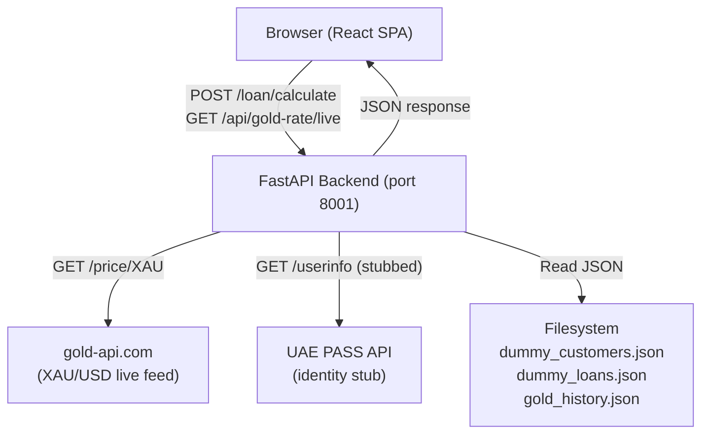
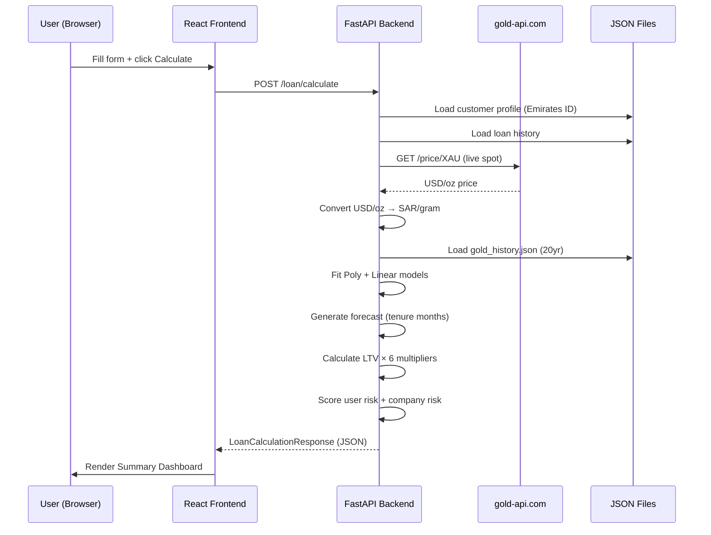
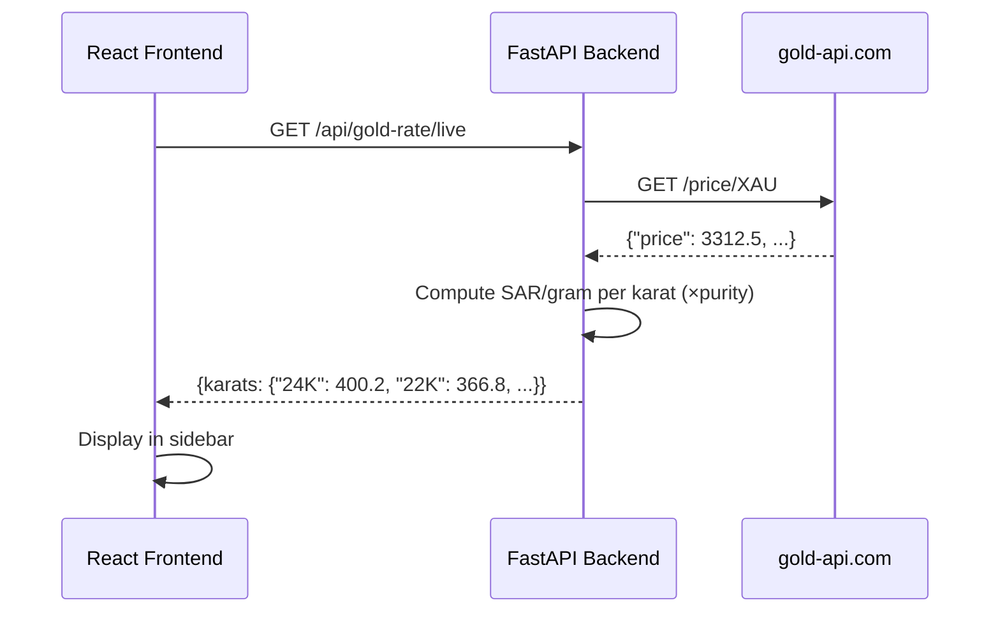
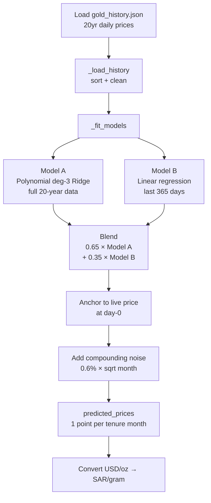
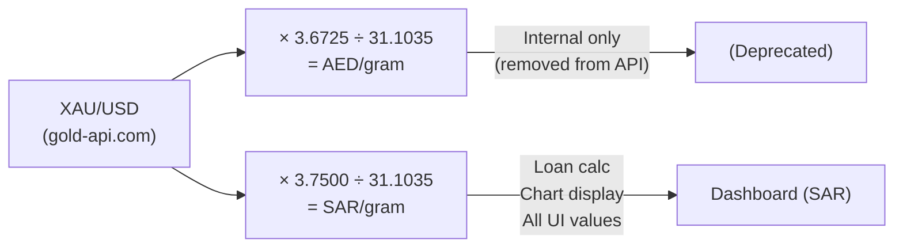

# ARCHITECTURE.md — System Architecture Document
**Project:** Gold LTV AI Calculator — Finance House Dubai
**Version:** 1.0
**Date:** 2026-05-01

---

## 1. High-Level Architecture Overview

The system is a two-tier web application: a React SPA (frontend) communicating directly with a FastAPI backend over HTTP. There is no persistent database — customer and loan data are loaded from JSON files on the filesystem. Gold price data is fetched live from an external API on every request.



---

## 2. Tech Stack

| Layer | Technology | Version | Justification |
|---|---|---|---|
| Frontend framework | React | 19.x | Industry standard SPA; fast re-renders for live data |
| Frontend build | Vite | 8.x | Fastest dev server + HMR; ESM native |
| CSS framework | Tailwind CSS | 4.x | Utility-first; no runtime overhead; rapid iteration |
| Backend framework | FastAPI | 0.110+ | Async Python; auto-generates OpenAPI docs; Pydantic integration |
| Backend server | Uvicorn | 0.29+ | ASGI server; production-grade async handling |
| Data validation | Pydantic v2 | 2.6+ | Type-safe models; fast serialisation |
| HTTP client (backend) | httpx | 0.27+ | Async HTTP for gold-api.com calls |
| ML / Numerics | NumPy + scikit-learn | 1.26+ / 1.4+ | Polynomial regression + Ridge regularisation for price forecasting |
| Data generation | Faker | 24.x | Realistic dummy customer/loan seeding |
| Environment config | python-dotenv | 1.0+ | `.env` for UAE PASS credentials |

---

## 3. Folder / Module Structure

```
GOLD-LTV-AI-calculator/
├── src/                          # React frontend
│   ├── App.jsx                   # Single-file app — all screens + components
│   ├── main.jsx                  # React DOM entry point
│   ├── App.css / index.css       # Global styles
│   └── assets/                   # Static images
│
├── backend/                      # FastAPI backend
│   ├── main.py                   # App bootstrap + all route handlers
│   ├── models.py                 # Pydantic enums + request/response models
│   ├── seed_data.py              # One-time data seeding script
│   ├── data/
│   │   ├── dummy_customers.json  # 20 seeded customer profiles
│   │   ├── dummy_loans.json      # Loan history per Emirates ID
│   │   └── gold_history.json     # 20-year daily gold price history (AED/oz)
│   └── services/
│       ├── gold_service.py       # Live price fetch + ML prediction pipeline
│       ├── customer_service.py   # Load customer/loan records from JSON
│       ├── loan_calculator.py    # LTV multiplier chain + eligible amount
│       ├── risk_analyzer.py      # User risk + company risk scoring
│       └── uaepass_service.py    # UAE PASS identity stub
│
├── docs/                         # Project documentation
│   ├── PLAN.md
│   ├── ARCHITECTURE.md
│   └── BRD.md
│
├── CALCULATIONS.md               # All formula reference with exact values
├── CLAUDE.md                     # Claude Code project context
├── vite.config.js                # Vite + Tailwind + proxy config
└── package.json                  # Frontend deps + npm scripts
```

> **Note:** Always run uvicorn from `backend/`.

---

## 4. Component / Service Breakdown

### Frontend Components (all in `src/App.jsx`)

| Component | Role |
|---|---|
| `App` | Root — manages screen state, live gold rate fetch, form state |
| `CalculatorScreen` | Form for carat, Emirates ID, weight, tenure, profession; shows live karat panel |
| `SummaryScreen` | Full dashboard after calculation; owns EMI calculator state |
| `PredictedLtvGoldTrendChart` | SVG polyline chart: 3-month history → current dot → forecast |
| `HorizontalRiskBar` | Animated fill bar for user/company risk scores |
| `CibilGauge` | SVG semicircle gauge for SIMAH score |
| `MetricChip` | Dark chip showing a label/value pair |
| `InfoCard` | White card with key-value rows (loan history overview) |
| `Field` | Labelled form input wrapper |

### Backend Services (`backend/services/`)

| Service | Responsibility |
|---|---|
| `gold_service.py` | Fetch XAU/USD, convert to SAR; build 3-month history; run ML blend forecast |
| `customer_service.py` | Load customer profiles and loan history from JSON; lazy-load on first request |
| `loan_calculator.py` | Apply 6-factor LTV chain; compute eligible + future-adjusted loan amounts |
| `risk_analyzer.py` | Score user risk (5 inputs) and company risk (3 inputs); return labels |
| `uaepass_service.py` | Return stub identity or call real UAE PASS API (production placeholder) |

---

## 5. Data Flow

### Calculator Submission Flow



### Live Gold Rate Fetch (on page load)



---

## 6. API Endpoints

| Method | Path | Description | Response |
|---|---|---|---|
| `GET` | `/health` | Health check | `{"status": "ok"}` |
| `GET` | `/api/gold-rate/live` | Live SAR karat rates | `{karats: {24K, 22K, 21K, 18K, 14K}}` |
| `GET` | `/gold/price` | Live AED price + karat map | `LiveGoldPriceResponse` |
| `GET` | `/gold/insights` | History + ML forecast for a tenure | `GoldInsights` |
| `GET` | `/customer/{emirates_id}` | Customer profile lookup | `CustomerProfile` |
| `GET` | `/customer/{emirates_id}/loans` | Loan history | `LoanHistoryOverview` |
| `POST` | `/loan/calculate` | Full eligibility calculation | `LoanCalculationResponse` |

### POST /loan/calculate — Request Body

```json
{
  "emirates_id": "784-1985-1234567-1",
  "carat": "22K",
  "gold_weight_grams": 100.0,
  "tenure_months": 12,
  "job_profession": "Government Employee"
}
```

### POST /loan/calculate — Response (key fields)

```json
{
  "system_decision": "Pre-Approved",
  "recommended_ltv_pct": 69.23,
  "gold_valuation_sar": 36680.00,
  "eligible_loan_amount_sar": 25388.00,
  "future_gold_valuation_sar": 38200.00,
  "future_eligible_loan_amount_sar": 25693.00,
  "suggested_tenure_months": 12,
  "cibil_score": 780,
  "cibil_label": "Excellent",
  "ltv_breakdown": { ... },
  "customer_profile": { ... },
  "loan_history": { ... },
  "gold_insights": { ... },
  "risk_insights": { ... },
  "live_gold_rates": { "24K": 400.2, ... }
}
```

---

## 7. Data Models

### Request

```
LoanCalculationRequest
  emirates_id:       str          (format: 784-YYYY-XXXXXXX-C)
  carat:             CaratType    (24K | 22K | 21K | 18K | 14K)
  gold_weight_grams: float        (> 0)
  tenure_months:     TenureMonths (6 | 12 | 18 | 24 | 36)
  job_profession:    JobProfession
```

### Key Response Models

```
LoanCalculationResponse
  system_decision                  str
  recommended_ltv_pct              float
  gold_valuation_sar               float
  eligible_loan_amount_sar         float
  future_gold_valuation_sar        float
  future_eligible_loan_amount_sar  float
  ltv_breakdown                    LTVBreakdown
  customer_profile                 CustomerProfile
  loan_history                     LoanHistoryOverview
  gold_insights                    GoldInsights
  risk_insights                    RiskInsights
  live_gold_rates                  dict[str, float]

GoldInsights
  live_price_sar_per_gram          float
  historical_prices                List[GoldPricePoint]   (3 monthly avg points)
  predicted_prices                 List[GoldPricePoint]   (1 per tenure month)
  predicted_change_pct             float
  trend                            str   (RISING | STABLE | FALLING)
  predicted_end_price_sar_per_gram float

RiskInsights
  user_risk_score      float   (0–100)
  user_risk_label      str     (LOW RISK | MEDIUM RISK | HIGH RISK | VERY HIGH RISK)
  company_risk_score   float   (0–100)
  company_risk_label   str
  company_risk_exposure str    (LOW | MEDIUM | HIGH | VERY HIGH)
```

### Gold History File Format

```json
[
  { "day": "2004-01-01", "max_price": 12500.0 },
  ...
]
```
Prices stored as AED per troy ounce. Approx 7,300 daily records (20 years).

---

## 8. ML Prediction Pipeline



---

## 9. Scalability & Performance Considerations

| Area | Current State | Production Recommendation |
|---|---|---|
| Customer data | JSON files, loaded into memory at first request | Replace with PostgreSQL + SQLAlchemy; connection pooling |
| Gold price | Fetched live per request (~200ms) | Cache with Redis (TTL 60s); serve cached value to reduce API calls |
| ML models | Refitted on every request (expensive) | Cache fitted models in memory on server startup; refit nightly |
| Frontend | Single `App.jsx` file (~900 lines) | Split into component files; add React.lazy for code splitting |
| Backend concurrency | Async FastAPI handles concurrent requests well | Add gunicorn + uvicorn workers for multi-core; use `--workers 4` |
| Gold history | 7,300 daily points loaded from disk per request | Load once at startup and cache in module-level variable |

---

## 10. Security Considerations

| Risk | Current Mitigation | Recommended |
|---|---|---|
| CORS open (`allow_origins=["*"]`) | Development only | Restrict to Finance House domain in production |
| No input sanitisation on Emirates ID | Pydantic validates string type | Add regex validation (`784-\d{4}-\d{7}-\d`) |
| UAE PASS credentials in `.env` | Excluded from git | Use secrets manager (AWS Secrets Manager / Azure Key Vault) |
| No rate limiting | None | Add `slowapi` middleware; limit `/loan/calculate` to 10 req/min per IP |
| JSON data files world-readable | Dev only | Replace with DB; restrict file permissions |
| No HTTPS | Dev only | Enforce TLS in production via reverse proxy (nginx/Caddy) |

---

## 11. Third-Party Integrations

| Service | Endpoint | Auth | Purpose | Fallback |
|---|---|---|---|---|
| gold-api.com | `https://api.gold-api.com/price/XAU` | None (public) | Live XAU/USD spot price | `FALLBACK_USD_OZ = 3300.0` |
| UAE PASS | `https://id.uaepass.ae/idshub/` | OAuth2 client_credentials | Borrower identity verification | Stub returns local DB profile |

---

## 12. Currency Architecture

All monetary values in the system flow through two conversion paths from the same `XAU/USD` source:



> All displayed amounts and loan calculations are in **SAR**. The AED conversion path was removed in favour of unified SAR throughout.
