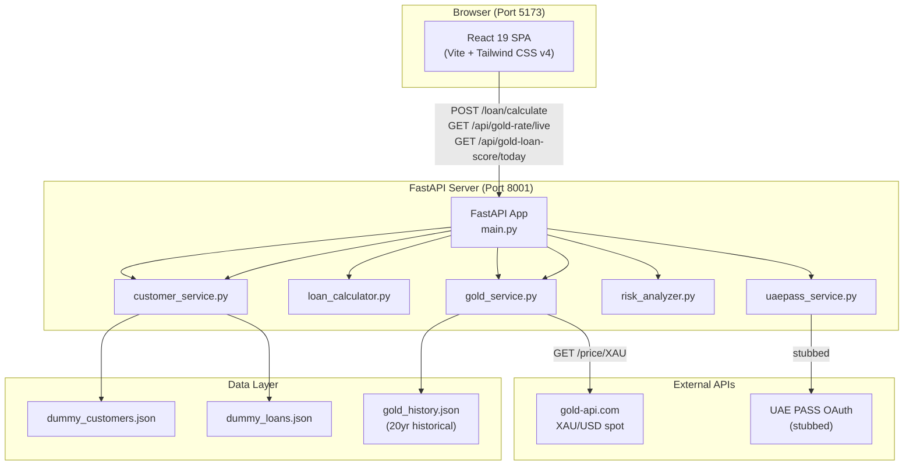
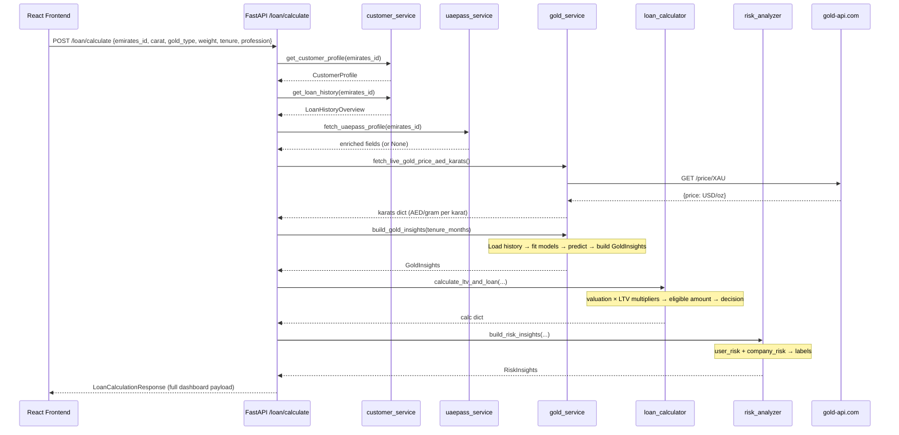
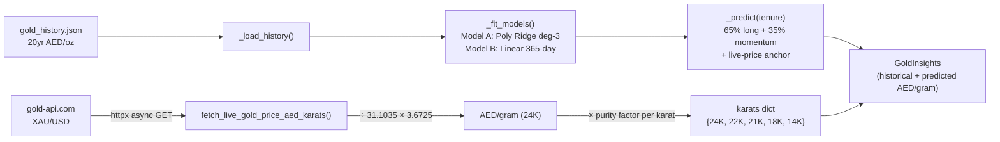
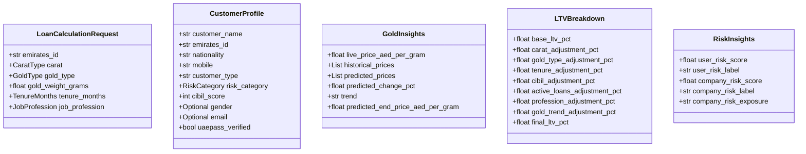

# ARCHITECTURE.md — System Architecture Document

**Project:** Gold Loan Valuation & Eligibility Dashboard  
**Client:** Finance House Dubai  
**Version:** 1.0  
**Date:** 2026-05-08

---

## 1. High-Level Architecture Overview

The system follows a classic **two-tier client-server architecture** with a React SPA frontend and a FastAPI backend. There is no separate database server — data is persisted in JSON flat files (seeded dummy data) and fetched live from an external gold price API.



---

## 2. Tech Stack

| Layer | Technology | Version | Justification |
|-------|-----------|---------|--------------|
| Frontend framework | React | 19.x | Industry-standard for dashboard UIs; large ecosystem |
| Frontend bundler | Vite | 8.x | Fast HMR; native ESM; simpler config than webpack |
| CSS framework | Tailwind CSS | 4.x | Utility-first; no CSS files to maintain for dashboards |
| Backend framework | FastAPI | 0.110+ | Async Python; auto Swagger UI; Pydantic validation built-in |
| Backend server | Uvicorn | 0.29+ | ASGI; required for FastAPI async routes |
| Data validation | Pydantic | 2.x | Strict typing; auto-generates OpenAPI schema |
| HTTP client | httpx | 0.27+ | Async; used to call gold-api.com |
| ML — regression | scikit-learn | 1.4+ | Polynomial Ridge pipeline; proven, stable |
| ML — numerics | NumPy | 1.26+ | Array operations for model training and prediction |
| Data generation | Faker | 24+ | Generates realistic dummy customer data |
| Env management | python-dotenv | 1.0+ | Loads `.env` for secrets (UAE PASS credentials) |

---

## 3. Folder / Module Structure

```
mobcoder-gold-poc/
├── src/
│   ├── App.jsx                    # Root: state, screen routing, API calls
│   ├── App.css                    # Global overrides
│   ├── index.css                  # Tailwind base import
│   ├── main.jsx                   # ReactDOM.createRoot entry
│   └── components/
│       └── GoldLoanWorkspace.jsx  # Calculator form + reverse calculator + rates panel
├── backend/
│   ├── main.py                    # FastAPI app + all route handlers
│   ├── models.py                  # Pydantic enums + request/response models
│   ├── seed_data.py               # One-time script: generates dummy_*.json files
│   ├── requirements.txt
│   ├── .env                       # (git-ignored) UAE PASS credentials
│   └── services/
│       ├── gold_service.py        # Live price fetch + ML prediction pipeline
│       ├── loan_calculator.py     # LTV calculation with all adjustment multipliers
│       ├── risk_analyzer.py       # User + company risk scoring
│       ├── customer_service.py    # JSON-backed customer + loan lookup
│       └── uaepass_service.py     # UAE PASS identity stub
│   └── data/
│       ├── gold_history.json      # 20-year daily gold prices (required)
│       ├── dummy_customers.json   # Seeded customer records
│       └── dummy_loans.json       # Seeded loan history records
├── docs/                          # Project documentation
├── public/                        # Static assets (favicon, icons)
├── index.html                     # Vite HTML entry point
├── vite.config.js
├── package.json
├── eslint.config.js
└── CALCULATIONS.md                # Full formula reference
```

---

## 4. Component / Service Breakdown

### Frontend Components

| Component | File | Responsibility |
|-----------|------|----------------|
| `App` | `src/App.jsx` | Global state, screen switching (`calculator` ↔ `summary`), API calls |
| `GoldLoanWorkspace` | `src/components/GoldLoanWorkspace.jsx` | Loan form, live rate table, reverse calculator, today's score |
| `RiskGauge` | inline in `App.jsx` | SVG arc gauge for user/company risk score |
| `CibilGauge` | inline in `App.jsx` | SVG arc gauge for CIBIL score |
| `PredictedLtvGoldTrendChart` | inline in `App.jsx` | SVG polyline chart for historical + predicted gold prices |

### Backend Services

| Service | File | Responsibility |
|---------|------|----------------|
| Gold Service | `services/gold_service.py` | Fetch live XAU/USD; load history; fit ML models; predict; build `GoldInsights` |
| Loan Calculator | `services/loan_calculator.py` | Gold valuation; LTV with all multipliers; eligible amounts; system decision |
| Risk Analyzer | `services/risk_analyzer.py` | User risk score (0–100); company risk score (0–100); labels |
| Customer Service | `services/customer_service.py` | Load customer profile and loan history from JSON by Emirates ID |
| UAE PASS Service | `services/uaepass_service.py` | Stub identity enrichment; returns hardcoded profiles for 3 known IDs |

---

## 5. Data Flow Diagrams

### Main Loan Calculation Flow



### Gold Price Feed Flow



---

## 6. API Design / Endpoints

All endpoints served by FastAPI on **port 8001**.  
Swagger UI: `http://localhost:8001/docs`

| Method | Path | Tag | Description |
|--------|------|-----|-------------|
| `GET` | `/health` | System | Health check |
| `GET` | `/gold/price` | Gold | Live XAU → AED/gram (all karats) |
| `GET` | `/api/gold-rate/live` | Gold | Live AED rates per karat (frontend format) |
| `GET` | `/api/gold-loan-score/today` | Gold | ML-based 1–10 timing score |
| `GET` | `/gold/insights` | Gold | Historical prices + tenure prediction |
| `GET` | `/customer/{emirates_id}` | Customer | Customer profile lookup |
| `GET` | `/customer/{emirates_id}/loans` | Customer | Loan history overview |
| `POST` | `/loan/calculate` | Loan | Full eligibility pipeline — main endpoint |

### Request Model: `POST /loan/calculate`

```json
{
  "emirates_id": "784-1985-1234567-1",
  "carat": "22K",
  "gold_type": "Jewellery",
  "gold_weight_grams": 100.0,
  "tenure_months": 12,
  "job_profession": "Government Employee"
}
```

### Response Model: `LoanCalculationResponse`

```json
{
  "system_decision": "Pre-Approved",
  "recommended_ltv_pct": 67.5,
  "gold_valuation_aed": 32083.33,
  "eligible_loan_amount_aed": 21656.25,
  "future_gold_valuation_aed": 33500.00,
  "future_eligible_loan_amount_aed": 21956.25,
  "suggested_tenure_months": 12,
  "cibil_score": 780,
  "cibil_label": "Excellent",
  "remarks": "Strong repayment history...",
  "ltv_breakdown": { ... },
  "customer_profile": { ... },
  "loan_history": { ... },
  "gold_insights": { ... },
  "risk_insights": { ... },
  "live_gold_currency": "AED",
  "live_gold_rates": { "24K": 387.12, "22K": 354.73, ... }
}
```

---

## 7. Data Models

### Core Enums

| Enum | Values |
|------|--------|
| `CaratType` | 24K, 22K, 21K, 18K, 14K |
| `TenureMonths` | 6, 12, 18, 24, 36, 48 |
| `JobProfession` | Government Employee, Private Employee, Business Owner, Self Employed, Retired, Freelancer |
| `GoldType` | Coin, Jewellery, Stone Jewellery |
| `LoanStatus` | ACTIVE, CLOSED, DEFAULTED |
| `RiskCategory` | A+, A, B+, B, C, D |

### Key Data Structures



### Data File Schemas

**`dummy_customers.json`** — array of customer objects:
```json
[{ "emirates_id": "...", "customer_name": "...", "cibil_score": 780, "risk_category": "A+", ... }]
```

**`dummy_loans.json`** — array of loan objects keyed by Emirates ID:
```json
[{ "emirates_id": "...", "loans": [{ "loan_id": "...", "status": "ACTIVE", "missed_emis": 0, ... }] }]
```

**`gold_history.json`** — array of daily price records:
```json
[{ "day": "2005-01-03", "max_price": 195.40 }, ...]
```

---

## 8. Authentication & Authorization

**Current state:** No authentication or authorization is implemented. The API accepts all requests.

**Production recommendations:**
- Add JWT-based auth (e.g., using `python-jose` + `fastapi-users`)
- Protect all `/loan/calculate` and customer endpoints with role-based access
- UAE PASS OAuth 2.0 integration: set `UAEPASS_CLIENT_ID` + `UAEPASS_CLIENT_SECRET` in `.env`
- Scope-based access: credit officers vs. read-only analysts

---

## 9. Scalability & Performance Considerations

| Concern | Current State | Production Path |
|---------|--------------|-----------------|
| Gold API latency | ~100–200ms per request to gold-api.com | Cache live price for 60s using Redis or in-memory LRU |
| ML model fitting | Fits models on every request (re-reads JSON each time) | Pre-fit at startup; cache models in memory |
| Data layer | JSON flat files (synchronous reads) | PostgreSQL / MongoDB with proper indexing |
| Concurrent users | Uvicorn handles async routes well | Add workers (`uvicorn --workers 4`) or switch to Gunicorn |
| Frontend bundle | Single Vite bundle | CDN + cache-control headers |
| Historical data loading | JSON read + sort on every request | Load once at startup into module-level variable |

---

## 10. Security Considerations

| Area | Current | Required for Production |
|------|---------|------------------------|
| CORS | `allow_origins=["*"]` | Restrict to known frontend origins |
| Input validation | Pydantic enforces types and ranges | Already strict; add rate limiting |
| Secrets | `.env` file (git-ignored) | Use environment secrets manager (AWS Secrets Manager, Azure Key Vault) |
| Error messages | FastAPI returns detailed 422/404 errors | Sanitize error responses; never expose stack traces |
| HTTPS | Not configured (dev only) | TLS termination via reverse proxy (Nginx / Caddy) |
| Auth | None | JWT + role-based access |

---

## 11. Third-Party Integrations

| Service | Purpose | Method | Fallback |
|---------|---------|--------|---------|
| `api.gold-api.com` | Live XAU/USD gold spot price | Async HTTP GET | `FALLBACK_USD_OZ = 3300.0 USD/oz` |
| UAE PASS | National identity enrichment (name, nationality, contact) | OAuth 2.0 (stubbed) | Original customer record used unchanged |
| scikit-learn | Polynomial regression for price prediction | Python import | NumPy `polyfit` fallback |
