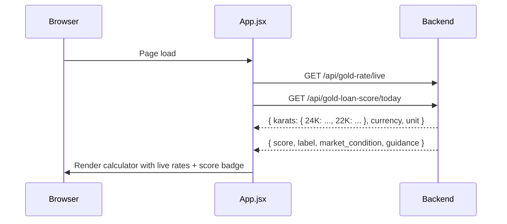
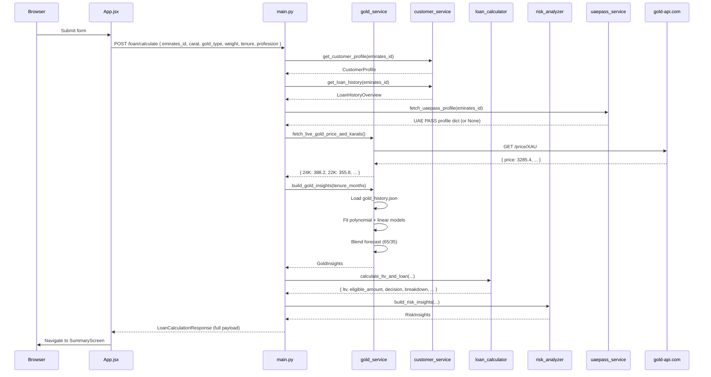
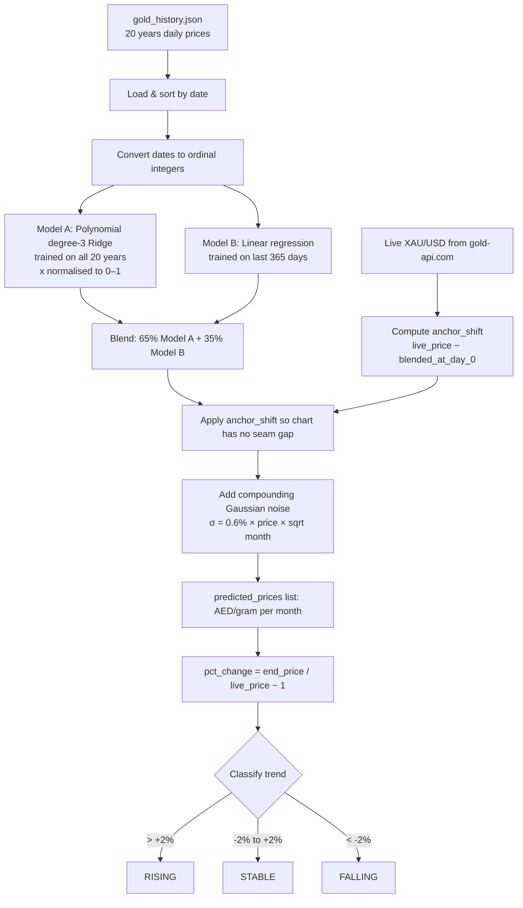

# ARCHITECTURE.md — System Architecture Document
# Gold Loan Valuation & Eligibility Dashboard — Finance House Dubai

---

## 1. High-Level Architecture Overview

The system is a two-tier client-server application: a **React SPA** (Single-Page Application) served by Vite, communicating over HTTP with a **FastAPI Python backend**. There is no session layer, no message broker, and no shared cache — every request is stateless. The backend aggregates data from three sources (live external API, static JSON files, ML models) and returns a single richly structured JSON payload per loan calculation request.

```
┌──────────────────────────────────────────────────────────────────┐
│                        Browser (Client)                          │
│  React 19 SPA  ←→  Tailwind CSS v4  ←→  Vite 8 Dev / Build      │
│                                                                  │
│   CalculatorScreen ──(form submit)──► SummaryScreen             │
│   GoldLoanWorkspace (layout + reverse calculator)               │
└────────────────────────┬─────────────────────────────────────────┘
                         │  HTTP / JSON  (port 8001)
                         ▼
┌──────────────────────────────────────────────────────────────────┐
│                    FastAPI Backend (Python)                       │
│                                                                  │
│  main.py (routes) ──► services/                                  │
│    ├── gold_service.py      (live price + ML pipeline)           │
│    ├── customer_service.py  (JSON file lookup)                   │
│    ├── loan_calculator.py   (LTV + eligibility)                  │
│    ├── risk_analyzer.py     (user + company risk)                │
│    └── uaepass_service.py   (identity enrichment stub)           │
│                                                                  │
│  models.py (Pydantic schemas)                                    │
└──────┬──────────────────────────┬────────────────────────────────┘
       │                          │
       ▼                          ▼
┌─────────────┐        ┌──────────────────────────┐
│ gold-api.com│        │  data/ (local JSON files) │
│ XAU/USD live│        │  gold_history.json        │
│  price feed │        │  dummy_customers.json     │
└─────────────┘        │  dummy_loans.json         │
                       └──────────────────────────┘
```

---

## 2. Tech Stack with Justification

### Frontend

| Technology | Version | Justification |
|-----------|---------|---------------|
| React | 19.2 | Industry-standard component model; hooks-based state suits the two-screen toggle pattern; large ecosystem |
| Vite | 8.x | Instant HMR, native ESM, fastest cold-start for a single-file SPA of this size |
| Tailwind CSS | v4.x | Utility-first CSS eliminates class-naming overhead; v4 ships as a Vite plugin (zero PostCSS config) |
| `@tailwindcss/vite` | 4.2 | Native Vite plugin — no separate PostCSS or config files needed |
| Vanilla `fetch` | — | No React Query or Axios needed; only 2 API call patterns in the app |

### Backend

| Technology | Version | Justification |
|-----------|---------|---------------|
| Python | 3.11+ | Mature ML ecosystem (`scikit-learn`, `numpy`); FastAPI requires 3.8+ |
| FastAPI | 0.110+ | Async-first, automatic Swagger UI, Pydantic-native; ideal for typed ML service APIs |
| Uvicorn | 0.29+ | ASGI server with `--reload` for development; production-ready with workers |
| Pydantic v2 | 2.6+ | Fast validation, native JSON serialization, strict typing enforced at API boundaries |
| httpx | 0.27+ | Async HTTP client for calling `gold-api.com`; drop-in `requests` replacement for `async` contexts |
| scikit-learn | 1.4+ | Ridge regression + PolynomialFeatures pipeline; NumPy fallback present if unavailable |
| NumPy | 1.26+ | Array operations for date ordinals and polynomial fitting |
| Faker | 24+ | Used only in `seed_data.py` to generate realistic dummy customer data |
| python-dotenv | 1.0+ | Loads `.env` for UAE PASS credentials |

---

## 3. Folder / Module Structure

```
GOLD-LTV-AI-calculator/
├── src/
│   ├── App.jsx                    # Root component: state, API calls, screen toggle
│   ├── App.css                    # Global styles (minimal)
│   ├── main.jsx                   # React DOM entry point
│   ├── index.css                  # Tailwind CSS import
│   ├── assets/                    # Static images
│   └── components/
│       └── GoldLoanWorkspace.jsx  # Calculator form + reverse calculator layout
│
├── public/
│   ├── favicon.svg
│   └── icons.svg
│
├── backend/
│   ├── main.py                    # FastAPI app, all route handlers
│   ├── models.py                  # All Pydantic request/response models
│   ├── seed_data.py               # One-time data generation script
│   ├── requirements.txt
│   ├── .env                       # UAEPASS_CLIENT_ID / SECRET (not committed)
│   ├── data/
│   │   ├── gold_history.json      # 20-year daily gold prices (AED/oz)
│   │   ├── dummy_customers.json   # Seeded customer profiles
│   │   └── dummy_loans.json       # Seeded loan records
│   └── services/
│       ├── gold_service.py        # Live fetch + ML prediction pipeline
│       ├── customer_service.py    # Profile + loan history lookup
│       ├── loan_calculator.py     # LTV multiplier chain + decision engine
│       ├── risk_analyzer.py       # User risk + company risk scoring
│       └── uaepass_service.py     # UAE PASS identity stub / production hook
│
├── docs/
│   ├── PLAN.md
│   ├── ARCHITECTURE.md            # (this file)
│   └── BRD.md
│
├── CALCULATIONS.md                # Full formula reference
├── CLAUDE.md                      # Claude Code project context
├── package.json
├── vite.config.js
├── eslint.config.js
└── index.html
```

---

## 4. Component / Service Breakdown

### Frontend Components

| Component | File | Responsibility |
|-----------|------|----------------|
| `App` | `src/App.jsx` | Root state machine: form data, live rates, today's score, active screen, valuation result. Owns all API fetch calls. |
| `GoldLoanWorkspace` | `src/components/GoldLoanWorkspace.jsx` | Renders calculator form, live rate ticker, reverse calculator panel, and Today's Loan Score badge. Props-only (no local API calls). |
| `CalculatorScreen` | Inline in `App.jsx` | Form inputs: carat, Emirates ID, gold weight, gold type, tenure, profession. Calls `handleCalculate` on submit. |
| `SummaryScreen` | Inline in `App.jsx` | Full eligibility dashboard. Renders all sections of `LoanCalculationResponse`. |
| `RiskGauge` | Inline in `App.jsx` | SVG radial gauge for user risk / company risk scores (0–100). |
| `CibilGauge` | Inline in `App.jsx` | SVG radial gauge for CIBIL score display. |
| `PredictedLtvGoldTrendChart` | Inline in `App.jsx` | SVG polyline chart rendering historical + predicted gold prices. |

### Backend Services

| Service | File | Responsibility |
|---------|------|----------------|
| **Gold Service** | `services/gold_service.py` | Fetch live XAU/USD → AED/gram; load 20-year history; fit polynomial + linear models; generate blended forecast; build `GoldInsights`. |
| **Customer Service** | `services/customer_service.py` | Load and return `CustomerProfile` and `LoanHistoryOverview` from JSON files by Emirates ID. |
| **Loan Calculator** | `services/loan_calculator.py` | Apply LTV multiplier chain; compute gold valuation; compute eligible loan amount; run decision scoring; return all fields for `LoanCalculationResponse`. |
| **Risk Analyzer** | `services/risk_analyzer.py` | Compute user risk score (5 components, max 100) and company risk score (3 components, max 100); return `RiskInsights`. |
| **UAE PASS Service** | `services/uaepass_service.py` | Return stub identity profile for known Emirates IDs; production OAuth2 hook in place. |

---

## 5. Data Flow Diagrams

### 5a. Application Startup (Page Load)



### 5b. Loan Calculation Request



### 5c. ML Prediction Pipeline (inside `gold_service.py`)



---

## 6. API Design / Endpoints

Base URL: `http://127.0.0.1:8001`

| Method | Endpoint | Tag | Description | Auth |
|--------|----------|-----|-------------|------|
| `GET` | `/health` | System | Service health check | None |
| `GET` | `/gold/price` | Gold | Live XAU/USD → AED/gram per karat | None |
| `GET` | `/api/gold-rate/live` | Gold | Same as above, alternate path used by frontend | None |
| `GET` | `/api/gold-loan-score/today` | Gold | ML-based 1–10 timing score for loan action today | None |
| `GET` | `/gold/insights?tenure_months=12` | Gold | Historical prices + ML forecast for given tenure | None |
| `GET` | `/customer/{emirates_id}` | Customer | Customer profile lookup | None |
| `GET` | `/customer/{emirates_id}/loans` | Customer | Loan history overview | None |
| `POST` | `/loan/calculate` | Loan | Full calculation pipeline → eligibility dashboard payload | None |

### `POST /loan/calculate` — Request Schema

```json
{
  "emirates_id": "784-1985-1234567-1",
  "carat": "22K",
  "gold_type": "Jewellery",
  "gold_weight_grams": 150.0,
  "tenure_months": 12,
  "job_profession": "Government Employee"
}
```

### `POST /loan/calculate` — Response Schema (abbreviated)

```json
{
  "system_decision": "Pre-Approved",
  "recommended_ltv_pct": 72.98,
  "gold_valuation_aed": 48750.00,
  "eligible_loan_amount_aed": 35594.00,
  "future_gold_valuation_aed": 51200.00,
  "future_eligible_loan_amount_aed": 36249.00,
  "suggested_tenure_months": 12,
  "cibil_score": 780,
  "cibil_label": "Excellent",
  "remarks": "Strong repayment history...",
  "ltv_breakdown": { ... },
  "customer_profile": { ... },
  "loan_history": { ... },
  "gold_insights": { ... },
  "risk_insights": { ... },
  "live_gold_currency": "AED",
  "live_gold_rates": { "24K": 388.2, "22K": 355.8, ... }
}
```

---

## 7. Data Models

### Enumerations

| Enum | Values |
|------|--------|
| `CaratType` | `24K`, `22K`, `21K`, `18K`, `14K` |
| `TenureMonths` | `6`, `12`, `18`, `24`, `36`, `48` |
| `JobProfession` | Government Employee, Private Employee, Business Owner, Self Employed, Retired, Freelancer |
| `GoldType` | Coin, Jewellery, Stone Jewellery |
| `LoanStatus` | ACTIVE, CLOSED, DEFAULTED |
| `RiskCategory` | A+, A, B+, B, C, D |

### Core Models

```
LoanCalculationRequest
  emirates_id: str
  carat: CaratType
  gold_type: GoldType
  gold_weight_grams: float (> 0)
  tenure_months: TenureMonths
  job_profession: JobProfession

CustomerProfile
  customer_name, emirates_id, nationality, mobile
  customer_type: "Existing" | "New"
  risk_category: RiskCategory
  cibil_score: int
  gender?, email?, full_name_ar?, nationality_ar?  (UAE PASS enriched)
  uaepass_verified: bool

LoanHistoryOverview
  total_previous, active_loans, closed_loans
  missed_emis, outstanding_balance
  loan_items: List[LoanHistoryItem]

GoldInsights
  live_price_aed_per_gram: float
  historical_prices: List[GoldPricePoint]  (last 3 months)
  predicted_prices: List[GoldPricePoint]   (next N months)
  predicted_change_pct: float
  trend: "RISING" | "STABLE" | "FALLING"
  predicted_end_price_aed_per_gram: float

LTVBreakdown
  base_ltv_pct, carat_adjustment_pct, gold_type_adjustment_pct
  tenure_adjustment_pct, cibil_adjustment_pct
  active_loans_adjustment_pct, profession_adjustment_pct
  gold_trend_adjustment_pct, final_ltv_pct

RiskInsights
  user_risk_score: float (0–100)
  user_risk_label: str
  company_risk_score: float (0–100)
  company_risk_label: str
  company_risk_exposure: "LOW" | "MEDIUM" | "HIGH" | "VERY HIGH"
```

### Data Files

| File | Format | Size | Contents |
|------|--------|------|----------|
| `gold_history.json` | `[{"day": "YYYY-MM-DD", "max_price": float}]` | ~7,300 rows | 20 years daily gold prices (AED/oz) |
| `dummy_customers.json` | `[{CustomerProfile fields}]` | 3 records | Seeded by `seed_data.py` |
| `dummy_loans.json` | `[{LoanHistoryItem fields}]` | Variable | Seeded by `seed_data.py` |

---

## 8. Authentication & Authorization

**Current state:** None. All API endpoints are publicly accessible with CORS `allow_origins=["*"]`.

**UAE PASS (stubbed):**
The `uaepass_service.py` module has a production-ready placeholder for OAuth2 Client Credentials flow:
1. `POST /idshub/token` → obtain `access_token`
2. `GET /idshub/userinfo` → fetch verified identity profile
3. Emirates ID in response is cross-checked against the request for security.

**Production requirements:**
- Set `UAEPASS_CLIENT_ID` + `UAEPASS_CLIENT_SECRET` in `backend/.env`
- Uncomment the production path in `fetch_uaepass_profile()`
- Restrict CORS to the known frontend origin
- Add API key or JWT middleware for the FastAPI endpoints

---

## 9. Scalability & Performance Considerations

| Concern | Current State | Production Path |
|---------|--------------|-----------------|
| **Gold history ML fit** | Fitted on every `/loan/calculate` request (~50ms) | Cache fitted models in memory at startup; re-fit on schedule |
| **Customer data** | JSON file read from disk per request | Replace with PostgreSQL + indexed Emirates ID column |
| **Live gold API** | 1 HTTP call per request, 8s timeout | Add Redis cache with 60s TTL; avoid hammering the external API |
| **FastAPI concurrency** | Async handlers; single process | Run with `--workers 4` (Gunicorn + Uvicorn workers) in production |
| **Frontend bundle** | ~200KB gzipped (React + Tailwind) | Static CDN hosting; Vite build already tree-shakes and minifies |
| **Gold history file** | Loaded fresh per request | Load once at module import level and keep in memory |

---

## 10. Security Considerations

| Risk | Current Mitigation | Recommended Fix |
|------|-------------------|-----------------|
| CORS `allow_origins=["*"]` | None | Restrict to frontend origin in production |
| No input sanitization on Emirates ID path param | FastAPI validates type (str) | Add regex pattern validation: `^784-\d{4}-\d{7}-\d$` |
| `backend/.env` committed? | `.env` listed — verify `.gitignore` | Ensure `.env` is in `.gitignore`; use secrets manager in production |
| Dummy customer data in repo | Faker-generated, not real PII | Confirm before production; do not seed real data in repo |
| External API (gold-api.com) | HTTPS; fallback if unreachable | Pin expected response schema; validate before using price |
| No rate limiting | Open endpoints | Add `slowapi` or nginx rate-limit in production |

---

## 11. Third-Party Integrations

| Integration | Endpoint | Protocol | Fallback |
|-------------|----------|----------|---------|
| **gold-api.com** — live XAU/USD | `https://api.gold-api.com/price/XAU` | HTTPS REST | `FALLBACK_USD_OZ = 3300.0` |
| **UAE PASS** — identity verification | `https://id.uaepass.ae/idshub/` | OAuth2 + HTTPS REST | Stub profiles for 3 seeded IDs |
