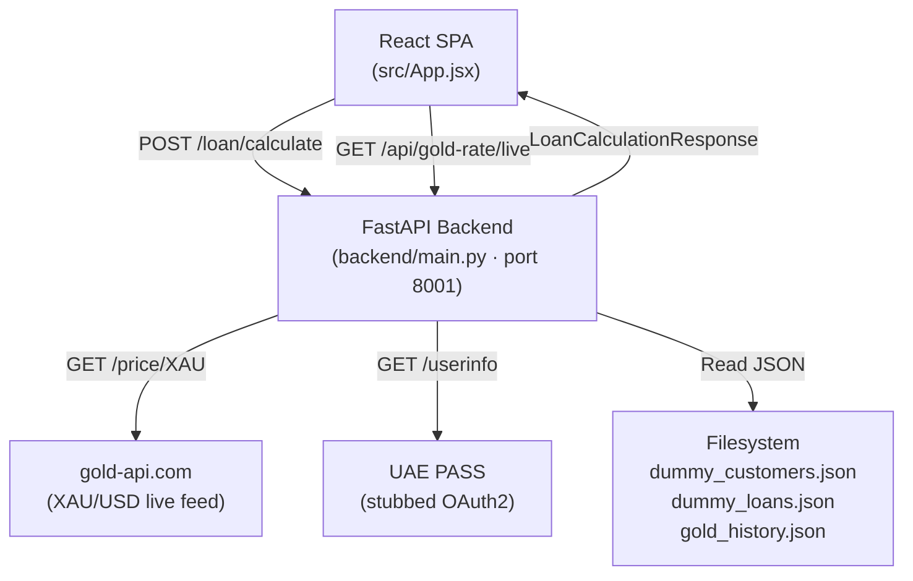

# FRD.md — Functional Requirements Document
**Project:** Gold LTV AI Calculator — Finance House Dubai
**Version:** 1.0
**Date:** 2026-05-01
**Status:** Draft
**Source of Truth:** BRD v1.0 / PRD v1.0

---

## 1. Document Purpose & Scope

This document provides the technical specification of all functional requirements for the Gold LTV AI Calculator system. It is written for developers, QA engineers, and technical reviewers. Every requirement traces back to a BRD reference and must be verifiable with a concrete test.

**In scope:** React frontend, FastAPI backend, gold price integration, ML prediction pipeline, LTV engine, risk scoring, EMI calculator, customer data lookup, UAE PASS stub.

**Out of scope:** Database migration, CI/CD, mobile, Arabic UI (see BRD Section 9).

---

## 2. System Overview



### Component Responsibilities

| Component | File | Responsibility |
|---|---|---|
| Frontend | `src/App.jsx` | Two-screen SPA: CalculatorScreen + SummaryScreen |
| API gateway | `backend/main.py` | Route handlers; orchestrates all services |
| Gold service | `backend/services/gold_service.py` | Live price fetch + ML prediction pipeline |
| Customer service | `backend/services/customer_service.py` | JSON-based customer + loan lookup |
| Loan calculator | `backend/services/loan_calculator.py` | LTV multiplier chain + eligible amounts |
| Risk analyser | `backend/services/risk_analyzer.py` | User risk + company risk scoring |
| UAE PASS service | `backend/services/uaepass_service.py` | Identity enrichment (stubbed) |
| Data models | `backend/models.py` | Pydantic request/response schemas |

---

## 3. Functional Requirements

| ID | Feature | Description | Input | Process | Output | Priority | BRD Ref |
|---|---|---|---|---|---|---|---|
| FR-001 | Live Gold Rate Panel | Display current SAR/gram price for 5 karats on page load | None (auto-fetch) | Fetch XAU/USD from gold-api.com; convert to SAR/gram; multiply by karat purity | `{24K, 22K, 21K, 18K, 14K}` rates in SAR | 🔴 Must Have | FR-01 |
| FR-002 | Gold Valuation | Compute market value of pledged gold | `weight_grams`, `carat`, `live_sar_per_gram` | `pure_grams = weight × purity`; `valuation_sar = pure_grams × live_sar_per_gram` | `gold_valuation_sar` (float, 2dp) | 🔴 Must Have | FR-02 |
| FR-003 | LTV Calculation | Apply 6-factor multiplier chain to base LTV | SIMAH score, missed EMIs, active loans, profession, carat, gold trend | `LTV = 0.75 × prod(all 6 multipliers)`; capped at 0.75 | `recommended_ltv_pct`, `ltv_breakdown` | 🔴 Must Have | FR-03 |
| FR-004 | Eligible Loan Amount | Maximum borrowable amount in SAR | `gold_valuation_sar`, `recommended_ltv_pct` | `eligible_loan_sar = valuation × ltv` | `eligible_loan_amount_sar` (float, 2dp) | 🔴 Must Have | FR-04 |
| FR-005 | Gold Forecast Chart | Visualise 3-month history + current + forecast | `tenure_months`, `gold_history.json`, live price | Monthly avg history (3 pts); ML blend prediction (N pts per tenure); anchor to live price | `historical_prices[]`, `predicted_prices[]`, `trend`, `predicted_change_pct` | 🟡 Should Have | FR-05 |
| FR-006 | Future-Adjusted Loan Estimate | Project eligible loan at tenure end with safety buffer | `predicted_end_price_sar_per_gram`, `gold_weight_grams`, `carat_purity`, `final_ltv` | `future_valuation = pure_grams × predicted_end_price`; `future_eligible = future_valuation × ltv × 0.97` | `future_gold_valuation_sar`, `future_eligible_loan_amount_sar` | 🟡 Should Have | FR-06 |
| FR-007 | Borrower Risk Score | Score borrower repayment probability 0–100 | SIMAH score, missed EMIs, active loans, profession, outstanding balance ratio | Weighted component sum (see FR-007 detail) | `user_risk_score`, `user_risk_label` | 🔴 Must Have | FR-07 |
| FR-008 | Company Risk Score | Score Finance House's default exposure 0–100 | `user_risk_score`, `final_ltv_pct`, `predicted_change_pct` | `company_risk = user_risk×0.40 + ltv_risk + market_risk` | `company_risk_score`, `company_risk_label`, `company_risk_exposure` | 🔴 Must Have | FR-08 |
| FR-009 | Customer Profile | Display verified borrower identity and loan summary | `emirates_id` | Lookup in `dummy_customers.json`; optionally enrich from UAE PASS | `CustomerProfile` object | 🟡 Should Have | FR-09 |
| FR-010 | Loan History | Display borrower's historical loans | `emirates_id` | Lookup in `dummy_loans.json` | `LoanHistoryOverview` with per-loan cards | 🟡 Should Have | FR-09 |
| FR-011 | EMI Calculator — Monthly | Calculate monthly reducing-balance EMI | `principal`, `annual_rate_pct`, `tenure_months` | `r = rate/12/100`; `EMI = P×r(1+r)^n / ((1+r)^n - 1)` | `emi_amount_sar` | 🔴 Must Have | FR-10 |
| FR-012 | EMI Calculator — Bullet Payment | Calculate lump-sum repayment | `principal`, `annual_rate_pct`, `tenure_months` | `bullet = P × (1 + rate × months/12)` | `bullet_payment_sar` | 🔴 Must Have | FR-10 |
| FR-013 | Amortization Schedule | Month-by-month repayment breakdown | `principal`, `monthly_rate`, `emi_amount`, `tenure_months` | For each month: `interest = balance × r`; `principal_paid = EMI − interest`; `balance -= principal_paid` | Array of `{month, emi, interest, principal_paid, balance}` | 🟡 Should Have | FR-11 |
| FR-014 | UAE PASS Identity Enrichment | Enrich customer profile from government identity provider | `emirates_id` | Call UAE PASS `/userinfo`; merge into customer profile; fallback to local DB on failure | Enriched `CustomerProfile` | 🟢 Could Have | FR-12 |
| FR-015 | Gold API Fallback | Ensure system operates when gold-api.com is unavailable | Gold API HTTP failure | Catch exception; use `FALLBACK_USD_OZ = 3300.0`; continue pipeline | All downstream values computed from fallback rate | 🔴 Must Have | NFR-R1 |
| FR-016 | Input Validation | Reject malformed requests before processing | Request body | Validate Emirates ID format `784-\d{4}-\d{7}-\d`; validate numeric ranges | HTTP 422 with field-level error detail | 🔴 Must Have | NFR-S2 |
| FR-017 | System Decision | Classify loan application outcome | `recommended_ltv_pct` | ≥70% → Pre-Approved; 55–69.99% → Manual Review; <55% → Rejected | `system_decision` string | 🟡 Should Have | FR-03 |

---

## 4. Use Case Specifications

### UC-001 — Full Loan Eligibility Calculation

| Field | Detail |
|---|---|
| **Use Case ID** | UC-001 |
| **Name** | Calculate Gold Loan Eligibility |
| **Actor(s)** | Credit Officer |
| **Preconditions** | Backend running on port 8001; `dummy_customers.json`, `dummy_loans.json`, `gold_history.json` present |

**Main Flow:**

1. Officer navigates to Calculator screen
2. System fetches live gold rates (`GET /api/gold-rate/live`) and displays karat panel
3. Officer selects carat (14K–24K), enters Emirates ID, gold weight (grams), tenure (months), profession
4. Officer clicks Calculate
5. System sends `POST /loan/calculate` with form payload
6. Backend loads customer profile by Emirates ID from `dummy_customers.json`
7. Backend loads loan history from `dummy_loans.json`
8. Backend optionally enriches profile from UAE PASS (stub)
9. Backend fetches live XAU/USD price from gold-api.com
10. Backend converts to SAR/gram; computes gold valuation
11. Backend loads `gold_history.json`; fits polynomial + linear models; generates forecast
12. Backend computes LTV via 6-factor multiplier chain
13. Backend scores user risk (5 components) and company risk (3 components)
14. Backend returns `LoanCalculationResponse` JSON
15. Frontend renders Summary Dashboard with all sections

**Alternate Flows:**

| Condition | System Response |
|---|---|
| Emirates ID not found in database | Return HTTP 404; frontend shows "Customer not found" error |
| gold-api.com returns non-200 | Use `FALLBACK_USD_OZ = 3300.0`; pipeline continues |
| UAE PASS unavailable | Silently use local customer record; no UI error |
| `gold_history.json` missing | Return HTTP 500 with message "Gold history file not found"; request fails |
| Invalid Emirates ID format | Return HTTP 422; frontend shows validation error before submission |

**Postconditions:** Dashboard renders with all data; no state persisted to disk.

---

### UC-002 — Live Gold Rate Fetch on Page Load

| Field | Detail |
|---|---|
| **Use Case ID** | UC-002 |
| **Name** | Load Live Karat Rates |
| **Actor(s)** | System (auto-triggered on CalculatorScreen mount) |
| **Preconditions** | Internet access available or fallback constant defined |

**Main Flow:**

1. CalculatorScreen component mounts in React
2. Frontend sends `GET /api/gold-rate/live`
3. Backend calls `https://api.gold-api.com/price/XAU`
4. Backend receives USD/oz price; computes SAR/gram = `(usd_oz / 31.1035) × 3.7500`
5. Backend computes per-karat rate = `sar_per_gram × karat_purity`
6. Backend returns `{karats: {24K: float, 22K: float, 21K: float, 18K: float, 14K: float}}`
7. Frontend displays rates in sidebar panel

**Alternate Flow:** gold-api.com unavailable → backend uses `FALLBACK_USD_OZ = 3300.0` → same conversion → response unchanged in structure.

**Postconditions:** Karat rates visible; 5-karat panel populated.

---

### UC-003 — EMI Calculation

| Field | Detail |
|---|---|
| **Use Case ID** | UC-003 |
| **Name** | Calculate Repayment Amount |
| **Actor(s)** | Credit Officer |
| **Preconditions** | Dashboard rendered; `eligible_loan_amount_sar` available |

**Main Flow:**

1. Officer selects repayment mode: "Monthly EMI" or "Bullet Payment"
2. Officer selects tenure from dropdown (3/6/12/18/24/36 months)
3. Officer enters annual interest rate (%)
4. System computes EMI in real-time (client-side, no API call)
5. Result displayed as `SAR X,XXX.XX`
6. If Monthly EMI mode: amortization schedule rendered below result

**Monthly EMI Calculation:**
```
r = annual_rate / 100 / 12
EMI = P × r × (1 + r)^n / ((1 + r)^n - 1)
```
Special case: if `r = 0`, then `EMI = P / n`.

**Bullet Payment Calculation:**
```
bullet = P × (1 + (annual_rate / 100) × (tenure_months / 12))
```

**Alternate Flow:** Rate not entered → no result shown; amortization table hidden.

**Postconditions:** Officer has repayment figure to present to borrower.

---

### UC-004 — Customer Profile Lookup

| Field | Detail |
|---|---|
| **Use Case ID** | UC-004 |
| **Name** | Load Borrower Profile and Loan History |
| **Actor(s)** | System (triggered as part of UC-001 step 6–7) |
| **Preconditions** | `dummy_customers.json` and `dummy_loans.json` loaded in memory |

**Main Flow:**

1. Backend receives Emirates ID from request
2. Customer service searches `dummy_customers.json` by `emirates_id` field
3. If found, returns `CustomerProfile`
4. Backend searches `dummy_loans.json` for all loans matching `emirates_id`
5. Aggregates: total loans, active count, closed count, missed EMI total, outstanding balance
6. Returns `LoanHistoryOverview` with per-loan list

**Alternate Flow:** Emirates ID not in JSON → raise `ValueError`; main.py catches and returns HTTP 404.

---

### UC-005 — ML Gold Price Forecast

| Field | Detail |
|---|---|
| **Use Case ID** | UC-005 |
| **Name** | Generate Gold Price Forecast for Loan Tenure |
| **Actor(s)** | System (triggered inside UC-001) |
| **Preconditions** | `gold_history.json` present with ≥ 365 daily records |

**Main Flow:**

1. Gold service loads `gold_history.json` (20-year daily records in AED/oz)
2. Sorts by date ascending
3. Fits Model A: Polynomial degree-3 Ridge regression on all 20 years of data
4. Fits Model B: Linear regression on last 365 days of data
5. For each tenure month M: `raw_pred = 0.65 × model_a.predict(t) + 0.35 × model_b.predict(t)`
6. Anchors predictions: shifts entire forecast so `pred[0] = live_price_usd_oz`
7. Adds compounding noise: `noise = pred × random(−0.006, +0.006) × sqrt(month_index)`
8. Converts predictions to SAR/gram: `sar = (usd_oz / 31.1035) × 3.7500`
9. Computes `predicted_change_pct = (end_price − live_price) / live_price × 100`
10. Classifies trend: `RISING` if change > 2%, `FALLING` if change < −2%, else `STABLE`
11. Builds 3-month history: last 3 complete calendar months, averaged by month
12. Returns `GoldInsights` payload

**Alternate Flow:** `gold_history.json` missing → `FileNotFoundError` propagates to HTTP 500.

---

## 5. Business Rules & Constraints

| ID | Rule | Detail |
|---|---|---|
| BR-001 | LTV ceiling | Final LTV must never exceed 75.00% for any input combination. Hard cap enforced in `loan_calculator.py`. |
| BR-002 | Base LTV | Starting point for all LTV calculations is exactly 0.75 (75%). |
| BR-003 | Carat purity values | 24K=1.0, 22K=0.9167, 21K=0.875, 18K=0.75, 14K=0.5833 — fixed constants; not configurable at runtime. |
| BR-004 | SAR conversion peg | 1 USD = 3.7500 SAR (fixed peg). |
| BR-005 | Troy ounce to gram | 1 troy oz = 31.1035 grams (fixed constant). |
| BR-006 | Fallback gold price | When gold-api.com unavailable: `FALLBACK_USD_OZ = 3300.0`. System continues normally. |
| BR-007 | Active loan factor | `max(0.80, 1 − active_loans × 0.06)` — minimum factor 0.80 regardless of active loan count. |
| BR-008 | Future-adjusted buffer | Future eligible loan = `future_valuation × ltv × 0.97`. 3% buffer is fixed. |
| BR-009 | System decision thresholds | ≥70% → Pre-Approved; 55%–69.99% → Manual Review; <55% → Rejected. |
| BR-010 | EMI rate zero case | If annual rate input is 0%, monthly EMI = `principal / tenure_months` (no division by zero). |
| BR-011 | ML blend weights | Long-term model (20yr): weight 0.65. Recent model (365-day): weight 0.35. Fixed constants. |
| BR-012 | ML noise cap | Compounding noise = `0.6% × sqrt(month_index)`. Applied per predicted point. |
| BR-013 | History display window | Chart always shows exactly 3 calendar months of monthly-averaged historical data. |
| BR-014 | UAE PASS failure handling | Any exception from UAE PASS service must be caught silently; local DB profile used. No error propagated to frontend. |
| BR-015 | Currency | All monetary amounts displayed and returned in SAR. No AED in API responses or UI. |

---

## 6. Data Requirements

### 6.1 API Request — `POST /loan/calculate`

| Field | Type | Validation | Required |
|---|---|---|---|
| `emirates_id` | `string` | Format: `784-\d{4}-\d{7}-\d` | Yes |
| `carat` | `enum` | One of: `14K`, `18K`, `21K`, `22K`, `24K` | Yes |
| `gold_weight_grams` | `float` | > 0 | Yes |
| `tenure_months` | `enum` (int) | One of: `6`, `12`, `18`, `24`, `36` | Yes |
| `job_profession` | `enum` | See Profession enum in `models.py` | Yes |

### 6.2 API Response — `LoanCalculationResponse`

| Field | Type | Description |
|---|---|---|
| `system_decision` | `string` | "Pre-Approved" / "Manual Review" / "Rejected" |
| `recommended_ltv_pct` | `float` | Final LTV % (0–75.00) |
| `gold_valuation_sar` | `float` | `pure_grams × live_sar_per_gram` |
| `eligible_loan_amount_sar` | `float` | `gold_valuation_sar × ltv` |
| `future_gold_valuation_sar` | `float` | `pure_grams × predicted_end_price_sar_per_gram` |
| `future_eligible_loan_amount_sar` | `float` | `future_gold_valuation_sar × ltv × 0.97` |
| `suggested_tenure_months` | `int` | Echo of input tenure |
| `cibil_score` | `int` | SIMAH score from customer record (300–900) |
| `cibil_label` | `string` | "Excellent" / "Good" / "Fair" / "Poor" |
| `ltv_breakdown` | `LTVBreakdown` | Per-multiplier delta values |
| `customer_profile` | `CustomerProfile` | See below |
| `loan_history` | `LoanHistoryOverview` | See below |
| `gold_insights` | `GoldInsights` | See below |
| `risk_insights` | `RiskInsights` | See below |
| `live_gold_rates` | `dict[str, float]` | Karat → SAR/gram map |

### 6.3 CustomerProfile

| Field | Type | Source |
|---|---|---|
| `name` | `string` | UAE PASS or local DB |
| `emirates_id` | `string` | Input |
| `nationality` | `string` | UAE PASS or local DB |
| `mobile` | `string` | Local DB |
| `gender` | `string` | Local DB |
| `email` | `string` | Local DB |
| `customer_type` | `string` | Local DB |
| `risk_category` | `string` | Local DB |

### 6.4 LoanHistoryOverview

| Field | Type | Computation |
|---|---|---|
| `total_loans` | `int` | Count of all loans for this Emirates ID |
| `active_loans` | `int` | Count where `status = ACTIVE` |
| `closed_loans` | `int` | Count where `status = CLOSED` |
| `total_missed_emis` | `int` | Sum of `missed_emis` across all loans |
| `outstanding_balance_sar` | `float` | Sum of `outstanding_balance` on active loans |
| `loans` | `List[LoanRecord]` | Per-loan detail list |

### 6.5 GoldInsights

| Field | Type | Description |
|---|---|---|
| `live_price_sar_per_gram` | `float` | Current spot price in SAR |
| `historical_prices` | `List[GoldPricePoint]` | 3 monthly averages |
| `predicted_prices` | `List[GoldPricePoint]` | 1 per tenure month |
| `predicted_change_pct` | `float` | `(end − live) / live × 100` |
| `trend` | `string` | `RISING` / `STABLE` / `FALLING` |
| `predicted_end_price_sar_per_gram` | `float` | SAR/gram at tenure end |

### 6.6 RiskInsights

| Field | Type | Description |
|---|---|---|
| `user_risk_score` | `float` | 0–100 |
| `user_risk_label` | `string` | LOW RISK / MEDIUM RISK / HIGH RISK / VERY HIGH RISK |
| `company_risk_score` | `float` | 0–100 |
| `company_risk_label` | `string` | LOW / MEDIUM / HIGH / VERY HIGH |
| `company_risk_exposure` | `string` | LOW / MEDIUM / HIGH / VERY HIGH |

### 6.7 JSON Data Files

| File | Format | Required |
|---|---|---|
| `backend/data/dummy_customers.json` | `[{emirates_id, name, nationality, mobile, gender, email, customer_type, risk_category, cibil_score, active_loans, total_loans, missed_emis, outstanding_balance}]` | Yes |
| `backend/data/dummy_loans.json` | `{emirates_id: [{loan_id, amount, tenure_months, status, missed_emis, outstanding_balance}]}` | Yes |
| `backend/data/gold_history.json` | `[{day: "YYYY-MM-DD", max_price: float}]` — prices in AED/troy oz | Yes |

---

## 7. LTV Multiplier Detail

### User Risk Score Components (FR-007)

| Component | Max Points | Formula |
|---|---|---|
| SIMAH score | 40 | ≥760→0, 700–759→8, 650–699→16, 600–649→24, 580–599→32, <580→40 (penalty pts; higher = riskier) |
| Missed EMIs | 20 | 0→0, 1→5, 2–3→10, 4–5→15, >5→20 |
| Active loans | 15 | 0→0, 1→5, 2→10, ≥3→15 |
| Profession | 15 | Government→0, Salaried→3, Business→7, Self-Employed→11, Freelancer→15 |
| Balance ratio | 10 | outstanding_balance / (eligible_loan_sar × 2); clamped 0–1; × 10 |
| **Total** | **100** | Higher score = higher risk |

### Company Risk Score Components (FR-008)

| Component | Max Points | Formula |
|---|---|---|
| User risk contribution | 40 | `user_risk_score × 0.40` |
| LTV risk | 35 | `((ltv − 0.50) / 0.25) × 35`; clamped 0–35 |
| Market risk | 25 | FALLING→25, STABLE→12.5, RISING→0 |
| **Total** | **100** | Higher score = higher company exposure |

### LTV Multiplier Values

| Factor | Multiplier Values |
|---|---|
| Carat | 24K=1.00, 22K=0.97, 21K=0.95, 18K=0.90, 14K=0.84 |
| SIMAH | ≥760→1.00, 700–759→0.97, 650–699→0.93, 600–649→0.88, 580–599→0.80, <580→0.65 |
| Missed EMIs | 0→1.00, 1→0.97, 2–3→0.93, 4–5→0.88, >5→0.78 |
| Active loans | `max(0.80, 1 − active_loans × 0.06)` |
| Profession | Government→1.00, Salaried→0.97, Business→0.93, Self-Employed→0.88, Freelancer→0.83 |
| Gold trend | RISING≥5%→1.05, RISING<5%→1.02, STABLE→1.00, FALLING>-5%→0.95, FALLING≤-5%→0.90 |

---

## 8. System Interface Requirements

### 8.1 Internal API Endpoints

| Method | Path | Auth | Request | Response | Timeout |
|---|---|---|---|---|---|
| `GET` | `/health` | None | — | `{"status": "ok"}` | 1s |
| `GET` | `/api/gold-rate/live` | None | — | `{karats: {24K: float, ...}}` | 2s |
| `GET` | `/gold/price` | None | — | `LiveGoldPriceResponse` | 2s |
| `GET` | `/gold/insights` | None | `?tenure_months=int` | `GoldInsights` | 3s |
| `GET` | `/customer/{emirates_id}` | None | Path param | `CustomerProfile` | 1s |
| `GET` | `/customer/{emirates_id}/loans` | None | Path param | `LoanHistoryOverview` | 1s |
| `POST` | `/loan/calculate` | None | `LoanCalculationRequest` | `LoanCalculationResponse` | 5s |

### 8.2 External Integrations

| Service | Endpoint | Protocol | Auth | Purpose | Fallback |
|---|---|---|---|---|---|
| gold-api.com | `https://api.gold-api.com/price/XAU` | HTTPS GET | None (public) | Live XAU/USD spot price | `FALLBACK_USD_OZ = 3300.0` |
| UAE PASS | `https://id.uaepass.ae/idshub/` | HTTPS / OAuth2 | `client_credentials` | Borrower identity enrichment | Local DB profile |

### 8.3 CORS Configuration

| Environment | Allowed Origins |
|---|---|
| Development | `*` (all origins) |
| Production | Finance House domain only (configure `ALLOWED_ORIGINS` env var) |

### 8.4 Environment Variables

| Variable | Required | Description |
|---|---|---|
| `UAEPASS_CLIENT_ID` | Production only | UAE PASS OAuth2 client ID |
| `UAEPASS_CLIENT_SECRET` | Production only | UAE PASS OAuth2 client secret |
| `FALLBACK_USD_OZ` | Optional | Override fallback gold price (default: 3300.0) |

---

## 9. Error Handling & Edge Cases

### 9.1 Per-Feature Error Handling

| Feature | Error Condition | System Response | HTTP Status |
|---|---|---|---|
| FR-001 | gold-api.com unreachable | Use `FALLBACK_USD_OZ`; return rates computed from fallback | 200 (transparent) |
| FR-001 | gold-api.com returns malformed JSON | Use fallback; log warning | 200 |
| FR-002 | `gold_weight_grams` = 0 or negative | Pydantic validation rejects | 422 |
| FR-003 | LTV computed > 0.75 | Hard-cap at 0.75 before returning | 200 (capped silently) |
| FR-004 | Emirates ID not in database | Raise ValueError; return error detail | 404 |
| FR-005 | `gold_history.json` missing | Raise FileNotFoundError; return server error | 500 |
| FR-005 | Fewer than 90 history records | Model may be inaccurate; still runs; no error | 200 |
| FR-007 | SIMAH score missing from record | Default to maximum risk contribution (40 pts) | 200 |
| FR-011 | Monthly rate is 0% | Use `EMI = P / n` (no division by zero) | 200 (client-side) |
| FR-014 | UAE PASS HTTP error | Catch all exceptions; return local DB profile | 200 (silent fallback) |
| FR-016 | Emirates ID wrong format | Pydantic raises ValidationError with field detail | 422 |
| FR-016 | `tenure_months` not in allowed values | Pydantic enum validation rejects | 422 |

### 9.2 Amortization Edge Cases

| Condition | Handling |
|---|---|
| Final balance rounds to non-zero due to float precision | Last month payment adjusted to clear remaining balance exactly |
| `tenure_months = 0` | Not possible — enum validation enforces minimum 3 months |
| Rate input is empty | No amortization computed; table not rendered |

---

## 10. Non-Functional Requirements

### 10.1 Performance

| Requirement | Target | Measurement |
|---|---|---|
| `POST /loan/calculate` total response time | < 3,000ms (p95) | End-to-end from request send to response received |
| `GET /api/gold-rate/live` response time | < 1,000ms (p95) | Includes gold-api.com round trip |
| ML model fitting time per request | < 500ms | `time()` around `_fit_models()` call |
| Frontend initial page load | < 2,000ms on 10 Mbps | Lighthouse TTI metric |
| EMI calculation client-side | < 50ms | Synchronous JS; no API call |

### 10.2 Security

| Requirement | Target | Implementation |
|---|---|---|
| Input validation | All inputs validated before processing | Pydantic v2 on all request models |
| Emirates ID format check | Regex enforced: `784-\d{4}-\d{7}-\d` | Pydantic `field_validator` |
| CORS | Restricted to Finance House domain in production | FastAPI `CORSMiddleware` |
| Secrets management | No credentials in source code or git history | `.env` file; `.gitignore` enforced |
| HTTPS | All production traffic over TLS | Reverse proxy (nginx / Caddy) |
| UAE PASS credentials | Not in git; stored in secrets manager in production | AWS Secrets Manager / Azure Key Vault |
| Rate limiting | 10 requests/minute per IP on `/loan/calculate` in production | `slowapi` middleware (Phase 6) |
| Dependency security | No known CVEs in production dependencies | `pip audit` in CI (Phase 6) |

### 10.3 Scalability

| Requirement | Target | Notes |
|---|---|---|
| Concurrent credit officers | 50 concurrent users | FastAPI async + uvicorn handles well; multi-worker for Phase 6 |
| Gold API call reduction | Max 1 call per 60 seconds | Cache with Redis in Phase 6; currently per-request |
| ML model refitting | Once per request in v1; once per night in Phase 6 | Cache fitted models at startup in Phase 6 |
| Customer data volume | JSON files adequate up to ~1,000 customers | Migrate to PostgreSQL at >1,000 customers |
| Request throughput | 50 req/min sustained | Async FastAPI baseline; scale with gunicorn workers |

### 10.4 Reliability

| Requirement | Target | Implementation |
|---|---|---|
| Gold API fallback | System functional when gold-api.com is down | `FALLBACK_USD_OZ = 3300.0` constant; catch all HTTP exceptions |
| UAE PASS fallback | No degradation when UAE PASS unavailable | Silent exception catch; local DB used |
| LTV ceiling | Never > 75% regardless of input | `min(computed_ltv, 0.75)` hard cap in `loan_calculator.py` |
| Error response format | All errors return `{"detail": "..."}` | FastAPI default error format |
| Data file integrity | Missing files caught at startup, not mid-request | Eager loading in `customer_service.py` on first request |

### 10.5 Usability

| Requirement | Target | Implementation |
|---|---|---|
| Single-page workflow | Zero page reloads after initial load | React SPA with `activeScreen` state toggle |
| Currency consistency | All monetary values in SAR; no AED in UI | All fields use `_sar` suffix; frontend formats with `formatSar()` |
| Colour coding | Risk: green ≤33, amber 34–66, red >67 | `HorizontalRiskBar` component |
| Loan status badges | ACTIVE=green, CLOSED=grey, DEFAULTED=red | Conditional CSS classes |
| Screen minimum | Usable at 1280px+ width | Tailwind responsive grid layout |
| Error messages | Field-level validation errors with actionable text | Pydantic error details surfaced to frontend |

### 10.6 Accessibility

| Requirement | Target |
|---|---|
| Colour contrast | WCAG 2.1 AA minimum (4.5:1 for normal text) |
| Keyboard navigation | All form inputs reachable via Tab key |
| Screen reader labels | All inputs have associated `<label>` elements |
| Risk bar accessibility | Score and label available as text (not colour only) |

---

## 11. Traceability Matrix

| FRD ID | FRD Feature | BRD Ref | PRD Feature | BRD Acceptance Criteria Met |
|---|---|---|---|---|
| FR-001 | Live Gold Rate Panel | FR-01 | F-01 | 5 karats within 1s; fallback on API failure |
| FR-002 | Gold Valuation | FR-02 | F-02 | `pure_grams × live_price` to 2dp |
| FR-003 | LTV Calculation | FR-03 | F-03 | Final LTV ≤75%; 6 multipliers in breakdown |
| FR-004 | Eligible Loan Amount | FR-04 | F-04 | `valuation × ltv` in SAR |
| FR-005 | Gold Forecast Chart | FR-05 | F-08 | 3 history pts + current dot + N forecast pts |
| FR-006 | Future-Adjusted Loan | FR-06 | F-09 | `future_val × ltv × 0.97`; delta % shown |
| FR-007 | Borrower Risk Score | FR-07 | F-05 | Score 0–100; correct colour zone |
| FR-008 | Company Risk Score | FR-08 | F-06 | `user×0.4 + ltv_risk + mkt_risk`; label correct |
| FR-009 | Customer Profile | FR-09 | F-10 | All available fields displayed |
| FR-010 | Loan History | FR-09 | F-11 | Loan cards with correct status badge |
| FR-011 | EMI Calculator — Monthly | FR-10 | F-07 | Formula matches test inputs |
| FR-012 | EMI Calculator — Bullet | FR-10 | F-07 | Bullet = `P(1 + rate × months/12)` |
| FR-013 | Amortization Schedule | FR-11 | F-12 | Interest decreases monotonically; final balance ≈ 0 |
| FR-014 | UAE PASS Enrichment | FR-12 | F-13 | Silent fallback to local DB |
| FR-015 | Gold API Fallback | NFR-R1 | F-14 | System runs at `FALLBACK_USD_OZ = 3300.0` |
| FR-016 | Input Validation | NFR-S2 | — | Emirates ID regex enforced; 422 on invalid |
| FR-017 | System Decision | FR-03 | F-03 | Thresholds: ≥70% Pre-Approved, 55–70% Manual, <55% Rejected |
