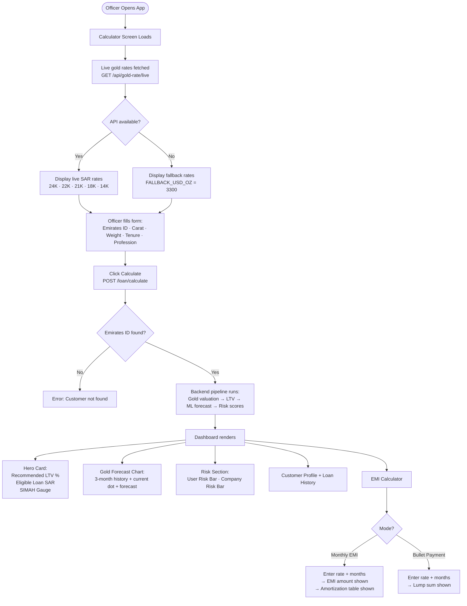
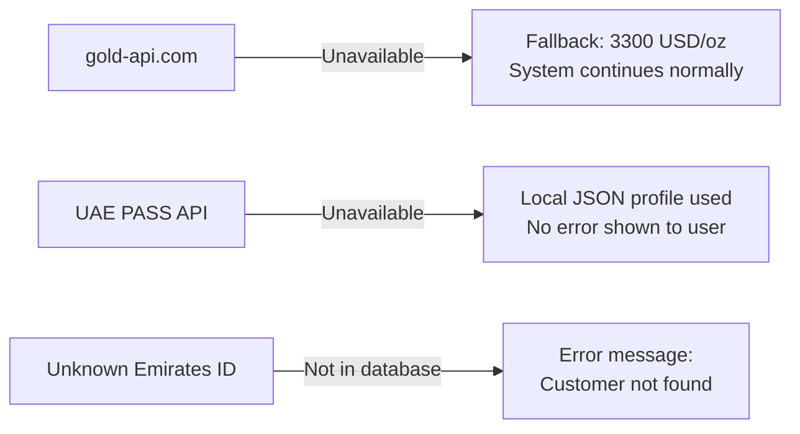

# PRD.md — Product Requirements Document
**Project:** Gold LTV AI Calculator — Finance House Dubai
**Version:** 1.0
**Date:** 2026-05-01
**Status:** Draft
**Source of Truth:** BRD v1.0

---

## 1. Product Vision & Mission

### Vision
Be the fastest, most consistent gold loan evaluation tool in the GCC — reducing every credit officer's assessment time from 30 minutes to under 3 minutes without sacrificing accuracy or auditability.

### Mission
Deliver a single-screen AI-assisted dashboard that automates gold valuation, risk scoring, and repayment structuring — so Finance House credit officers can make data-driven lending decisions in real time, with zero dependency on manual price tables or intuition.

---

## 2. Problem Statement

Finance House Dubai's gold loan assessment process is broken at three levels:

| Level | Problem | Impact |
|---|---|---|
| Speed | Officers manually look up gold prices and calculate LTV using spreadsheets | 15–30 min per application; borrowers wait |
| Consistency | No standardised scoring — two officers assess the same application differently | Inconsistent loan approvals; regulatory exposure |
| Risk visibility | No forward-looking analysis of gold price trends | Collateral may erode during loan tenure; undetected until too late |

The opportunity is to replace this manual pipeline with a real-time dashboard that fetches live gold prices, applies a standardised multi-factor LTV model, predicts future collateral value using ML, scores borrower and company risk, and structures repayment plans — all in a single interaction.

---

## 3. Target Users & Personas

### Persona 1 — Credit Officer (Primary User)

> **"I need the number fast and I need to trust it."**

| Attribute | Detail |
|---|---|
| Name (representative) | Sarah Al-Mansoori |
| Role | Credit Officer, Finance House Dubai |
| Daily task volume | 15–25 gold loan assessments per shift |
| Tools today | Excel spreadsheet, manual gold price lookup, intuition |
| Tech comfort | Moderate — comfortable with web apps, not developers |
| Primary goal | Complete each assessment accurately in under 3 minutes |
| Pain points | Stale gold prices, inconsistent LTV decisions across colleagues, manual EMI calculation on a calculator app |
| Success looks like | Submit Emirates ID + gold details → see eligible amount, risk score, repayment options in one screen |

**Key jobs to be done:**
- Know today's real gold price per karat before discussing with borrower
- Calculate how much the borrower can receive against their gold
- Understand if the borrower is a credit risk
- Present monthly payment options the borrower can understand

---

### Persona 2 — Credit Manager (Secondary User)

> **"I need to know every decision was made consistently and can be explained."**

| Attribute | Detail |
|---|---|
| Name (representative) | Ahmed Hassan |
| Role | Credit Manager / Team Lead |
| Daily task | Review borderline cases escalated by officers; audit loan decisions |
| Primary goal | Confirm that LTV calculations follow company policy; that risk flags are visible |
| Pain points | Cannot verify how an officer arrived at a number; no audit trail |
| Success looks like | LTV breakdown with each multiplier shown; risk scores with component visibility |

---

### Persona 3 — Borrower (Indirect Beneficiary)

> **"I want to know how much I can get and what I have to pay each month."**

| Attribute | Detail |
|---|---|
| Context | Walks into Finance House branch or applies remotely |
| Primary concern | Will my gold cover the loan I need? What are my monthly payments? |
| Pain points | Long wait times; uncertainty about the process |
| Success looks like | Officer gives a clear answer in under 3 minutes; shows exact EMI schedule |

---

## 4. Product Goals & Success Metrics

### OKRs

| Objective | Key Result | Target | Timeline |
|---|---|---|---|
| Eliminate manual gold pricing | % applications using live rate from system | 100% | Phase 1 |
| Standardise LTV decisions | Variance between two officers on same application | 0% | Phase 2 |
| Reduce assessment time | Average time per completed application | < 3 minutes | Phase 4 |
| Improve collateral risk detection | ML trend direction accuracy (RISING/STABLE/FALLING) | ≥ 70% correct | Phase 3 |
| Score every application | % applications with user + company risk score | 100% | Phase 2 |
| Enable EMI planning | EMI calculator available on every dashboard | 100% coverage | Phase 5 |

### KPIs (Operational)

| KPI | Measurement Method | Target |
|---|---|---|
| Dashboard load time | Backend response time for `POST /loan/calculate` | < 3 seconds |
| Gold rate freshness | Time since last live fetch at submission | < 60 seconds (cached TTL) |
| System uptime | Availability during business hours | ≥ 99% |
| Fallback activation rate | % requests served from fallback gold price | < 5% |
| EMI calculator usage rate | % dashboard sessions that use EMI tool | Track; inform v2 |

---

## 5. Feature List — MoSCoW Prioritization

| # | Feature | Priority | BRD Ref | Rationale |
|---|---|---|---|---|
| F-01 | Live gold rate panel (5 karats) | 🔴 Must Have | FR-01 | Core input; without it, no valuation |
| F-02 | Gold valuation calculator | 🔴 Must Have | FR-02 | Primary calculation; drives all downstream values |
| F-03 | Multi-factor LTV engine | 🔴 Must Have | FR-03 | Policy compliance; standardisation |
| F-04 | Eligible loan amount display | 🔴 Must Have | FR-04 | Core output officers need |
| F-05 | Borrower (user) risk score | 🔴 Must Have | FR-07 | Critical for credit decision |
| F-06 | Company risk score | 🔴 Must Have | FR-08 | Finance House exposure visibility |
| F-07 | EMI calculator (monthly + bullet) | 🔴 Must Have | FR-10 | Needed to present repayment to borrower |
| F-08 | Gold price forecast chart | 🟡 Should Have | FR-05 | Forward-looking risk; core AI differentiator |
| F-09 | Future-adjusted loan estimate | 🟡 Should Have | FR-06 | Adds predictive value to eligible amount |
| F-10 | Customer profile display | 🟡 Should Have | FR-09 | Context for credit decision |
| F-11 | Loan history cards | 🟡 Should Have | FR-09 | Repayment behaviour context |
| F-12 | Amortization schedule | 🟡 Should Have | FR-11 | Borrower transparency |
| F-13 | UAE PASS identity enrichment | 🟢 Could Have | FR-12 | Nice-to-have verification; currently stubbed |
| F-14 | Gold API fallback (hardcoded rate) | 🔴 Must Have | NFR-R1 | Reliability; system must work even if API is down |

---

## 6. User Stories Per Feature

### F-01 — Live Gold Rate Panel

> **As a** credit officer,
> **I want** to see current gold prices per karat (14K–24K) the moment I open the calculator,
> **so that** I can verify the market rate before entering an application.

**Acceptance Criteria:**
- [ ] Rates display within 1 second of page load
- [ ] Five karats shown: 24K, 22K, 21K, 18K, 14K
- [ ] All rates in SAR/gram
- [ ] If API is unavailable, fallback rate is shown without an error message

---

### F-02 — Gold Valuation Calculator

> **As a** credit officer,
> **I want** the system to compute the gold's market value from the weight and carat I enter,
> **so that** I don't have to manually look up purity fractions or do the arithmetic.

**Acceptance Criteria:**
- [ ] Formula: `pure_grams = weight_grams × karat_purity`; `valuation_sar = pure_grams × live_sar_per_gram`
- [ ] Purity values: 24K=1.0, 22K=0.9167, 21K=0.875, 18K=0.75, 14K=0.5833
- [ ] Result displayed as `SAR X,XXX.XX` on the dashboard
- [ ] Recalculates automatically when carat or weight changes

---

### F-03 — Multi-Factor LTV Engine

> **As a** credit officer,
> **I want** the system to show a recommended LTV percentage with a breakdown of every factor applied,
> **so that** I can explain the figure to the borrower and satisfy the credit manager.

**Acceptance Criteria:**
- [ ] Base LTV starts at 75%; never exceeded in output
- [ ] Six multipliers applied in sequence: carat, SIMAH score, missed EMIs, active loans, profession, gold trend
- [ ] Each multiplier's contribution shown as a delta in the breakdown panel
- [ ] Final LTV rounded to 2 decimal places

---

### F-04 — Eligible Loan Amount

> **As a** credit officer,
> **I want** to immediately see the maximum SAR amount the applicant can borrow,
> **so that** I can inform the borrower and proceed to repayment planning.

**Acceptance Criteria:**
- [ ] `eligible_loan_sar = gold_valuation_sar × final_ltv_pct`
- [ ] Displayed prominently in the hero card on the dashboard
- [ ] Formatted as `SAR X,XXX.XX`

---

### F-05 — Borrower Risk Score

> **As a** credit officer,
> **I want** a 0–100 borrower risk score with a visual risk bar,
> **so that** I can instantly gauge repayment probability without reading through raw credit data.

**Acceptance Criteria:**
- [ ] Score derived from 5 weighted components (SIMAH 40, missed EMIs 20, active loans 15, profession 15, balance ratio 10)
- [ ] Displayed as horizontal fill bar: green (0–33), amber (34–66), red (67–100)
- [ ] Label: LOW RISK / MEDIUM RISK / HIGH RISK / VERY HIGH RISK

---

### F-06 — Company Risk Score

> **As a** credit officer,
> **I want** to see Finance House's exposure risk if this loan defaults,
> **so that** I can make a fully-informed approval recommendation.

**Acceptance Criteria:**
- [ ] Score = `(user_risk × 0.40) + ltv_risk_pts + market_risk_pts`
- [ ] RISING gold trend reduces company risk (lower liquidation loss)
- [ ] Same horizontal fill bar + colour scheme as user risk
- [ ] Exposure label: LOW / MEDIUM / HIGH / VERY HIGH

---

### F-07 — EMI Calculator

> **As a** credit officer,
> **I want** to switch between monthly EMI and bullet payment modes and enter a rate and tenure,
> **so that** I can present the borrower with the repayment figure that suits them.

**Acceptance Criteria:**
- [ ] Toggle between "Monthly EMI" and "Bullet Payment" modes
- [ ] Month dropdown: 3, 6, 12, 18, 24, 36
- [ ] Annual interest rate free-text input (%)
- [ ] Monthly mode: reducing balance formula `P × r(1+r)^n / ((1+r)^n - 1)`
- [ ] Bullet mode: simple interest `P × (1 + rate × months/12)`
- [ ] Result shown as `SAR X,XXX.XX`

---

### F-08 — Gold Price Forecast Chart

> **As a** credit officer,
> **I want** to see a chart of gold's recent history and predicted price through the loan tenure,
> **so that** I can assess whether the collateral value is at risk of dropping.

**Acceptance Criteria:**
- [ ] Chart shows 3 monthly average history points (real data)
- [ ] Green dot at current live price
- [ ] Predicted monthly points for full tenure duration
- [ ] Trend label: RISING / STABLE / FALLING
- [ ] Predicted % change over tenure displayed below chart

---

### F-09 — Future-Adjusted Loan Estimate

> **As a** credit officer,
> **I want** to see what the eligible loan would be at tenure end if gold performs as predicted,
> **so that** I can understand collateral headroom over the loan period.

**Acceptance Criteria:**
- [ ] Computed as `predicted_end_gold_valuation × final_ltv × 0.97` (3% safety buffer)
- [ ] Delta vs current eligible amount shown as ▲/▼ percentage
- [ ] Labelled as a model estimate, not a guarantee

---

### F-10 — Customer Profile

> **As a** credit officer,
> **I want** to see the borrower's verified profile details in the same dashboard,
> **so that** I have all context I need without switching systems.

**Acceptance Criteria:**
- [ ] Fields: name, Emirates ID, nationality, mobile, gender, email, customer type, risk category
- [ ] Enriched from UAE PASS if available; falls back to local record silently

---

### F-11 — Loan History

> **As a** credit officer,
> **I want** to see a summary of the borrower's past loans and their statuses,
> **so that** I can see their repayment behaviour at a glance.

**Acceptance Criteria:**
- [ ] Overview: total loans, active count, closed count, missed EMI count, outstanding balance
- [ ] Per-loan cards: loan ID, amount, tenure, status badge (ACTIVE / CLOSED / DEFAULTED)
- [ ] Status badges colour-coded

---

### F-12 — Amortization Schedule

> **As a** credit officer,
> **I want** a scrollable month-by-month repayment table when monthly EMI mode is active,
> **so that** I can walk the borrower through exactly what they pay each month.

**Acceptance Criteria:**
- [ ] Columns: Month | EMI | Principal Paid | Interest Paid | Remaining Balance
- [ ] Principal values in green (increases each month)
- [ ] Interest values in red (decreases each month)
- [ ] Table scrollable, max 220px height, sticky header
- [ ] Only shown in Monthly EMI mode after rate is entered

---

### F-13 — UAE PASS Enrichment

> **As a** credit officer,
> **I want** the borrower's verified government identity details auto-populated from UAE PASS,
> **so that** I don't have to manually enter contact information.

**Acceptance Criteria:**
- [ ] Emirates ID triggers UAE PASS profile lookup
- [ ] Verified name, nationality, contact details populate the customer profile
- [ ] Silent fallback to local database if UAE PASS is unavailable
- [ ] No user-facing error for UAE PASS unavailability

---

## 7. User Journey & Flow

### Primary Flow — Credit Officer Assessment

### Error & Fallback Paths

---

## 8. Product Assumptions & Constraints

### Assumptions

| # | Assumption |
|---|---|
| A-01 | Credit officers use a modern desktop browser (Chrome 110+, Firefox 110+, Safari 16+) |
| A-02 | Backend and frontend run on the same internal network or machine |
| A-03 | All Emirates IDs are pre-seeded; new applicants require manual seeding by IT |
| A-04 | Interest rates entered by officers are annual percentage rates (APR) |
| A-05 | `gold_history.json` covers ≥ 1 year of data for ML model to be statistically meaningful |
| A-07 | Officers understand that the future-adjusted loan estimate is a model projection, not a commitment |

### Constraints

| # | Constraint |
|---|---|
| C-01 | Gold price data sourced exclusively from `gold-api.com` free tier (no SLA guarantee) |
| C-02 | Historical gold price data is a static JSON file — not auto-updated |
| C-03 | UAE PASS real OAuth2 flow requires UAE government approval; currently stubbed |
| C-04 | No persistent database in v1; all data is JSON file-based |
| C-05 | Frontend is a single-page app in one file (`App.jsx`) — no component library or router |
| C-06 | LTV ceiling of 75% is a hard business rule; no input combination may exceed it |
| C-07 | Screen minimum: 1280px width (credit officer desktop workflow) |

---

## 9. Out of Scope — This Version

| Feature | Reason | Future Version? |
|---|---|---|
| Loan origination & disbursement | Separate core banking system | No — different platform |
| Document upload / KYC management | Requires document management platform | Phase 2+ |
| Real database (PostgreSQL) | Phase 6 future work | Yes — Phase 6 |
| Mobile application | Officer workflow is desktop-only | Possible future |
| Arabic UI | Future localisation | Yes — Phase 7 |
| Automated gold history updates | Manual file update process | Yes — future automation |
| Multi-branch / multi-role management | Single-role POC | Phase 6+ |
| Loan repayment tracking | Separate loan management system | No — different platform |
| Regulatory reporting | Out of scope for this dashboard | Separate compliance tool |
| Export to PDF / print view | Not requested | Could Have in v2 |

---

## 10. Release Strategy & Phasing

### MVP (Phases 1–4) — Core Assessment Dashboard

**Goal:** Replace spreadsheet-based assessment entirely. Officer can enter gold details and get a complete eligibility decision.

| Feature | Included in MVP |
|---|---|
| Live gold rate panel | ✅ |
| Gold valuation + LTV calculation | ✅ |
| Eligible loan amount | ✅ |
| User + company risk scores | ✅ |
| Customer profile + loan history | ✅ |
| Gold forecast chart | ✅ |
| Future-adjusted loan estimate | ✅ |
| EMI calculator | ❌ Phase 5 |
| Amortization schedule | ❌ Phase 5 |
| UAE PASS enrichment | ❌ Stub only |

### v1.1 (Phase 5) — EMI Planning

**Goal:** Give officers a built-in repayment planning tool so borrowers get payment details in the same session.

- Monthly EMI calculator (reducing balance)
- Bullet payment calculator
- Amortization schedule

### v2.0 (Phase 6) — Production Readiness

**Goal:** Move from POC to production-grade system.

- PostgreSQL database (replace JSON files)
- Real UAE PASS OAuth2 integration
- Redis caching for gold prices
- CORS locked to Finance House domain
- Rate limiting on API endpoints
- CI/CD pipeline
- Load testing

---

## 11. Open Questions & Decisions Needed

| # | Question | Owner | Priority |
|---|---|---|---|
| OQ-02 | Has UAE government approved real UAE PASS credentials? If not, ETA? | Management | Medium — blocks real identity verification |
| OQ-03 | What is the gold history data refresh cadence? Who is responsible for updating `gold_history.json`? | Finance House IT | Medium — affects ML accuracy over time |
| OQ-04 | Should the LTV ceiling (75%) be configurable per product type, or fixed globally? | Credit Management | High — design decision before v2 |
| OQ-05 | Should the future-adjusted estimate be labelled differently from the eligible amount to avoid officer confusion? | UX / Credit Management | Medium |
| OQ-06 | Are there additional profession categories not covered in the current list? | Credit Management | Medium — affects LTV calculation coverage |
| OQ-07 | Is the SIMAH score always available for all borrowers? What is the fallback if missing? | Credit Officers | High — affects risk scoring completeness |
| OQ-08 | What is Finance House's target for concurrent credit officers in production? (BRD states 50; confirm) | IT / Management | Medium — affects infrastructure sizing |
| OQ-09 | Should bullet payment show a payment schedule (single row) or just the total? | Credit Officers | Low — UX decision |
| OQ-10 | Should the system support AED as a secondary display currency for borrowers? | Management | Low — out of scope v1 |
