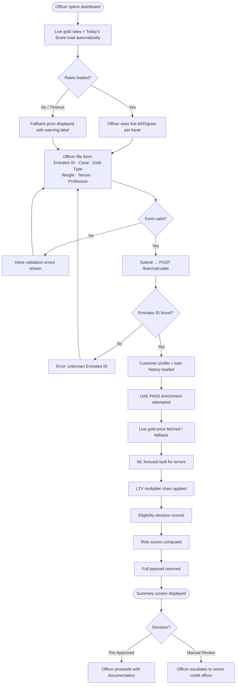
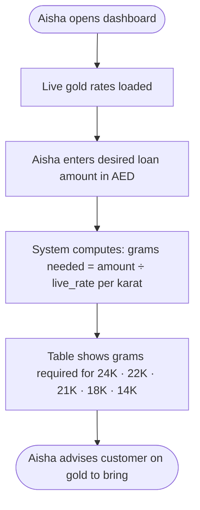

# PRD.md — Product Requirements Document
# Gold Loan Valuation & Eligibility Dashboard — Finance House Dubai

**Version:** 1.0  
**Date:** 2026-05-08  
**Status:** Draft  
**Source:** BRD v1.0 (docs/BRD.md)

---

## 1. Product Vision & Mission Statement

### Vision
Every Finance House loan officer, at any branch, reaches a consistent, data-backed gold loan decision in under one minute — powered by live market data and machine intelligence.

### Mission
Deliver an internal decision-support tool that eliminates manual spreadsheet calculations, surfaces real-time gold pricing and ML-driven trend forecasts, and enforces regulatory LTV limits — so that every gold loan application is processed faster, more accurately, and with a full audit trail.

---

## 2. Problem Statement

Finance House Dubai loan officers currently process gold loan applications manually:

- Gold prices are looked up from external sources and entered into spreadsheets.
- LTV multipliers (carat, CIBIL, profession, active loans, missed EMIs) are applied by hand — inconsistently across officers and branches.
- No gold price forecasting informs the decision: the officer has no visibility into how the collateral value may move over the loan tenure.
- Customer identity is verified separately; UAE PASS data is never integrated at the point of application.
- No standardised risk score exists for either the borrower or the institution.

**Result:** Applications take 10–15 minutes each, decisions vary by officer, and the institution carries unquantified collateral risk.

---

## 3. Target Users & Personas

### Persona 1 — The Loan Officer (Primary)

| Attribute | Detail |
|-----------|--------|
| **Name** | Omar — Branch Loan Officer |
| **Role** | Processes gold loan applications at a Finance House branch |
| **Tech comfort** | Moderate — comfortable with web forms; not a power user |
| **Goal** | Complete an application in < 1 minute; get a clear Yes / Review decision |
| **Pain points** | Spreadsheet is slow and easy to miskey; gold prices change between lookup and entry; different results than colleagues for the same customer |
| **Context** | Sits across from a customer; needs to communicate a decision or loan amount quickly |
| **Success looks like** | Enters 6 fields, gets Pre-Approved / Manual Review with an amount in under 60 seconds |

---

### Persona 2 — The Credit Analyst (Secondary)

| Attribute | Detail |
|-----------|--------|
| **Name** | Fatima — Credit Analyst |
| **Role** | Reviews borderline cases, escalations, and daily loan quality |
| **Tech comfort** | High — uses data regularly; comfortable reading charts and scores |
| **Goal** | Understand why a decision was made; verify each LTV factor; assess collateral risk over the loan tenure |
| **Pain points** | No breakdown of how LTV was derived; no gold price context; different numbers from different officers for the same application |
| **Context** | Reviews a stack of applications; needs to justify decisions to compliance and branch management |
| **Success looks like** | Full LTV breakdown with delta per factor; risk score with components; gold price trend chart for the tenure |

---

### Persona 3 — The Risk Manager (Governance)

| Attribute | Detail |
|-----------|--------|
| **Name** | Khalid — Risk & Compliance Manager |
| **Role** | Ensures all decisions comply with CBUAE LTV cap; monitors institution-level exposure |
| **Tech comfort** | Medium — reads reports; does not process applications |
| **Goal** | Confirm LTV never exceeds 75%; understand company risk exposure per application |
| **Pain points** | No audit trail from spreadsheet decisions; no company-level risk metric per loan |
| **Context** | Reviews reports periodically; may investigate a specific application after the fact |
| **Success looks like** | Company risk score (0–100) on every application; LTV hard cap enforced automatically |

---

### Persona 4 — The Customer-Facing Officer (Supporting)

| Attribute | Detail |
|-----------|--------|
| **Name** | Aisha — Customer Relationship Officer |
| **Role** | Advises walk-in customers on what gold to bring for a target loan amount |
| **Tech comfort** | Moderate |
| **Goal** | Tell the customer how many grams of gold (by karat) they need for a desired loan |
| **Pain points** | Has to estimate gold weight manually; live rates change frequently |
| **Context** | Pre-application guidance; customer has not yet brought gold to branch |
| **Success looks like** | Enters desired loan amount; sees grams required per karat based on live rates |

---

## 4. Product Goals & Success Metrics

### OKRs

| Objective | Key Result | Target | Measurement |
|-----------|-----------|--------|-------------|
| Eliminate manual calculation | Application processing time | < 1 minute (from ~15) | Officer-reported time per application |
| Fully deterministic decisions | LTV variance across officers for identical inputs | 0% | QA test: same inputs → same LTV on 3 different sessions |
| Real-time market context | Gold rate display latency from page load | P95 < 3 seconds | Browser DevTools / synthetic monitoring |
| Accurate ML forecasting | MAE of 12-month gold price prediction vs actuals | < 8% | Backtesting on held-out 2024 data |
| Complete risk coverage | % of submitted applications with user + company risk scores | 100% | Log audit |
| Reliable system | Backend uptime | > 99.5% | Uptime monitoring |

### KPIs (Post-Launch)

| KPI | Target |
|-----|--------|
| Average applications processed per officer per hour | ≥ 6 (vs current ~4) |
| % applications with Pre-Approved decision matching senior credit officer retrospective review | ≥ 90% |
| % of page loads that display live gold rates (not fallback) | ≥ 95% |
| Officer satisfaction score (internal survey) | ≥ 4/5 |

---

## 5. Feature List — MoSCoW Prioritization

### Must Have (MVP — launch blocker)

| # | Feature | BRD Ref | Rationale |
|---|---------|---------|-----------|
| M-01 | Application input form (6 fields) | FR-04 | Core entry point; nothing works without it |
| M-02 | Live gold price display (all 5 karats) | FR-01 | Required for accurate valuation |
| M-03 | Gold valuation calculation (AED) | FR-05 | Primary output of the tool |
| M-04 | LTV calculation with all multipliers | FR-06, FR-09 | Regulatory requirement; CBUAE compliance |
| M-05 | Eligibility decision (Pre-Approved / Manual Review) | FR-08 | Core product output |
| M-06 | Customer profile auto-load by Emirates ID | FR-11 | Eliminates duplicate data entry |
| M-07 | Loan history display | FR-12 | Required for CIBIL + EMI-based LTV factors |
| M-08 | User risk score (0–100) | FR-14 | Standardised borrower risk output |
| M-09 | Company risk score (0–100) | FR-15 | Institution exposure measurement |
| M-10 | LTV breakdown with per-factor deltas | FR-09 | Audit trail; decision explainability |
| M-11 | CIBIL score + label display | FR-10 | Credit quality indicator |
| M-12 | Gold price fallback when API is unavailable | NFR-18 | Reliability requirement |

---

### Should Have (strong value; target for launch)

| # | Feature | BRD Ref | Rationale |
|---|---------|---------|-----------|
| S-01 | Today's Gold Loan Score (1–10 market timing badge) | FR-02 | Guides officer on urgency; differentiator |
| S-02 | Historical + predicted gold price chart | FR-03 | Context for credit analyst persona |
| S-03 | Future-adjusted loan estimate at tenure end | FR-07 | Forward-looking customer guidance |
| S-04 | UAE PASS identity enrichment (Arabic name, gender, email) | FR-13 | Reduces manual identity verification |
| S-05 | Human-readable decision remarks | FR-08 | Officer communication aid |
| S-06 | Reverse calculator (grams needed for target loan amount) | FR-16 | Serves customer-facing officer persona |

---

### Could Have (nice-to-have; include if time permits)

| # | Feature | Rationale |
|---|---------|-----------|
| C-01 | Gold trend RISING/STABLE/FALLING badge on calculator screen | Market context before submission |
| C-02 | Print / export summary screen to PDF | Branch record-keeping |
| C-03 | Application history list (session-level) | Officer reviews multiple applications without re-entering data |
| C-04 | Officer notes field on summary screen | Capture manual observations alongside system output |
| C-05 | Tooltips on LTV breakdown factors | Self-serve training for new officers |

---

### Won't Have (explicitly excluded from v1)

| # | Feature | Reason Excluded |
|---|---------|----------------|
| W-01 | Loan disbursement / payment processing | Requires core banking integration; out of scope |
| W-02 | Write operations to customer / loan records | Read-only data layer in v1 |
| W-03 | Login, authentication, role-based access control | Internal tool; deferred to v2 |
| W-04 | Mobile-native app (iOS / Android) | Web-only in v1 |
| W-05 | SMS / email notifications | No notification infrastructure |
| W-06 | Arabic UI | Deferred; English-only in v1 |
| W-07 | CRM / core banking integration | Separate project scope |
| W-08 | Customer self-service portal | Internal tool only |
| W-09 | Automated regulatory reporting | Deferred to v2 |
| W-10 | Branch-level dashboards | Aggregate analytics deferred |

---

## 6. User Stories Per Feature

### M-01 — Application Input Form

> **As** Omar (Loan Officer), **I want** a single form with clearly labelled fields for Emirates ID, carat, gold type, weight, tenure, and profession **so that** I can enter all application data in one place and submit for an instant decision.

> **As** Fatima (Credit Analyst), **I want** form fields to validate input before submission **so that** I don't receive calculation errors caused by missing or malformed data.

---

### M-02 — Live Gold Price Display

> **As** Omar, **I want** to see live AED/gram prices for all karats (24K to 14K) on the page when it loads **so that** I can confirm today's market rate before discussing the application with the customer.

> **As** Omar, **I want** to see a "fallback" label if the live price feed is unavailable **so that** I know the displayed rate is an estimate, not a live market price.

---

### M-03 & M-04 — Valuation + LTV

> **As** Omar, **I want** the system to calculate the gold's current AED value and the eligible loan amount automatically after I submit the form **so that** I never have to perform this calculation manually.

> **As** Khalid (Risk Manager), **I want** the LTV to be automatically capped at 75% for all applications **so that** Finance House remains compliant with CBUAE regulations without relying on officer knowledge of the cap.

---

### M-05 — Eligibility Decision

> **As** Omar, **I want** a clear Pre-Approved or Manual Review label with a plain-language explanation **so that** I immediately know whether to proceed with documentation or escalate to a senior officer.

---

### M-06 & M-07 — Customer Profile + Loan History

> **As** Omar, **I want** the customer's name, nationality, risk category, and loan history to load automatically when I enter their Emirates ID **so that** I don't have to look these up separately.

> **As** Fatima, **I want** to see a full loan history table showing active, closed, and defaulted loans with missed EMI counts **so that** I can assess repayment behaviour as part of my review.

---

### M-08 & M-09 — Risk Scores

> **As** Khalid, **I want** a user risk score (0–100) based on CIBIL, EMI history, active loans, profession, and outstanding balance **so that** every application has a standardised, auditable borrower risk number.

> **As** Khalid, **I want** a company risk score (0–100) that accounts for gold market outlook separately from borrower risk **so that** I can distinguish between a risky borrower backed by excellent rising-gold collateral and a genuinely high-risk exposure for the institution.

---

### S-01 — Today's Gold Loan Score

> **As** Aisha (Customer-Facing Officer), **I want** a 1–10 daily market timing score with a short guidance phrase **so that** I can advise walk-in customers on whether today is a good time to take a gold loan.

---

### S-02 — Gold Price Chart

> **As** Fatima, **I want** a chart showing the last 3 months of gold prices alongside a ML-generated forecast for the loan tenure **so that** I can visually assess whether the collateral value is likely to rise or fall over the repayment period.

---

### S-03 — Future Loan Estimate

> **As** Omar, **I want** to see a future-adjusted loan amount projected to the end of the loan tenure **so that** I can show the customer a forward-looking picture of their gold's likely value.

---

### S-04 — UAE PASS Enrichment

> **As** Omar, **I want** UAE PASS verified identity data (Arabic name, gender, verified email, UAE PASS badge) to appear on the customer profile automatically **so that** I can confirm identity without a separate manual check.

---

### S-06 — Reverse Calculator

> **As** Aisha, **I want** to enter a desired loan amount and see how many grams of gold (per karat) the customer needs to bring **so that** I can give precise guidance to customers who are preparing their collateral.

---

## 7. User Journey / Flow Overview

### Primary Flow — Loan Officer Processing an Application

---

### Supporting Flow — Reverse Calculator (Pre-Application)

---

## 8. Product Assumptions & Constraints

### Assumptions

| # | Assumption |
|---|-----------|
| PA-01 | All operational values (loan amounts, valuations) are in AED; SAR is display-only reference |
| PA-02 | AED/USD peg (3.6725) and SAR/USD peg (3.7500) are treated as fixed constants |
| PA-03 | CIBIL scores are pre-loaded in the customer data system; the product does not call a live credit bureau |
| PA-04 | Users are internal Finance House staff; no public-facing authentication is required in v1 |
| PA-05 | `gold_history.json` is maintained and kept reasonably current by the operations team |
| PA-06 | Three seeded Emirates IDs cover demonstration and UAT needs |
| PA-07 | The 75% LTV ceiling reflects current CBUAE guidelines and will not change without regulatory notice |

### Constraints

| # | Constraint | Product Impact |
|---|-----------|---------------|
| PC-01 | LTV must never exceed 75% (CBUAE regulation) | Hard cap enforced in calculation engine; no UI override allowed |
| PC-02 | UAE PASS real credentials not yet provisioned | Identity enrichment runs in stub mode; production switch is a config change, not a code change |
| PC-03 | Customer data is read-only in v1 | No create / edit / delete customer or loan flows in this product |
| PC-04 | Backend URL is currently hardcoded to port 8001 | Multi-environment deployment requires environment variable before v2 |
| PC-05 | System is internal only until CORS and auth are hardened | No public URL; deploy behind VPN or internal network only |

---

## 9. Out of Scope for This Version

The following will not appear in v1 and should not be designed for or partially built:

- Loan disbursement, repayment tracking, or payment scheduling
- Customer or loan record creation / editing
- Login, authentication, or role-based access control
- Mobile-native applications
- SMS or email notifications to customers or officers
- Core banking system or CRM integration
- Production UAE PASS OAuth2 (credentials gate)
- Automated regulatory or compliance reporting
- Arabic language UI
- Branch-level aggregate reporting or management dashboards
- Customer self-service portal

---

## 10. Release Strategy / Phasing

### MVP (Version 1.0) — Internal Launch

**Goal:** Replace spreadsheet-based gold loan calculations entirely for all branch officers.

**Included features:** All Must Have (M-01 through M-12) + Should Have (S-01 through S-06).

**Not included:** Could Have and Won't Have features above.

**Go-live criteria:**
- All Must Have features functional and tested
- LTV calculation matches CALCULATIONS.md formula for 5 known test cases
- Fallback gold price activates gracefully on simulated API outage
- Deployed on internal network; accessible from branch workstations

---

### Version 1.1 — Hardening Release

**Goal:** Production-grade reliability and security.

**Planned additions:**
- CORS restricted to known origin
- Backend URL driven by environment variable
- Emirates ID regex validation on API
- Rate limiting on all endpoints
- Unit tests for `loan_calculator.py` and `risk_analyzer.py` (≥ 80% coverage)
- `gold_history.json` update script (automated or scheduled)

---

### Version 2.0 — Platform Release

**Goal:** Multi-user access control, persistent data, and banking integration.

**Planned additions:**
- Login and role-based access (Loan Officer / Credit Analyst / Risk Manager)
- PostgreSQL or equivalent replacing JSON data files
- Production UAE PASS OAuth2 integration
- Application audit log (who submitted, what inputs, what decision)
- Arabic UI option
- PDF export of summary screen
- Branch-level reporting dashboard
- CRM / core banking integration (separate scoping required)

---

## 11. Open Questions & Decisions Needed

| # | Question | Owner | Status |
|---|----------|-------|--------|
| OQ-01 | Will UAE PASS TRA credentials be provisioned before v1 launch, or must stub mode go to production? | Finance House IT | Open |
| OQ-02 | What is the target deployment environment — cloud (Azure/AWS), on-premise, or VPN-accessible VM? | Finance House IT / DevOps | Open |
| OQ-03 | Should the fallback gold price (`FALLBACK_USD_OZ = 3300.0`) be configurable by operations without a code deploy? | Product / Dev | Open |
| OQ-04 | Is `gold_history.json` updated manually, or does the team want an automated nightly sync from a data provider? | Finance House Operations | Open |
| OQ-05 | Does v1 need any form of session logging or application audit trail, even without full authentication? | Compliance | Open |
| OQ-06 | Should the system support loan tenures beyond 48 months in future releases? | Credit Policy | Open |
| OQ-07 | Will the CIBIL score continue to be the credit proxy, or will a UAE-specific credit score (AECB score) replace it in v2? | Risk / Compliance | Open |
| OQ-08 | Is a PDF export of the summary screen required for branch physical records before v1 or can it wait for v1.1? | Branch Operations | Open |
