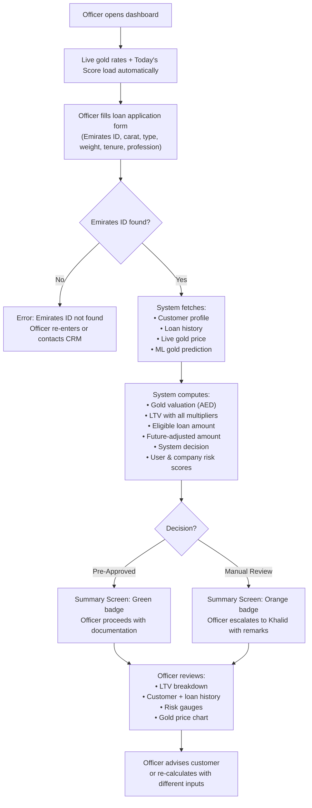

# PRD.md — Product Requirements Document

**Project:** Gold Loan Valuation & Eligibility Dashboard  
**Client:** Finance House Dubai  
**Version:** 1.0  
**Date:** 2026-05-08

---

## 1. Product Vision & Mission Statement

**Vision:** Become Finance House Dubai's single source of truth for gold loan eligibility — a system that any credit officer can open, enter a customer's details, and receive an instant, auditable, ML-backed loan decision in under 5 seconds.

**Mission:** Replace spreadsheet-based gold loan appraisals with a real-time, formula-enforced, risk-scored digital dashboard that gives every officer the same information, the same formula, and the same quality of decision — every time.

---

## 2. Problem Statement

Credit officers at Finance House Dubai currently spend 15–30 minutes per gold loan application performing manual calculations: looking up live gold prices, applying carat corrections, checking CIBIL from one system and loan history from another, estimating risk subjectively, and arriving at an LTV figure that varies by officer. There is no view of how gold prices might change over the loan tenure, leaving collateral risk unquantified. This creates inconsistent customer outcomes, elevated credit risk, and operational inefficiency.

---

## 3. Target Users & Personas

### Persona 1 — Rania Al-Hassan, Senior Credit Officer

| Attribute | Detail |
|-----------|--------|
| Role | Senior Credit Officer, Gold Loans desk |
| Experience | 8 years in banking; 3 years at Finance House |
| Tech comfort | Comfortable with web apps; uses Excel daily |
| Goal | Process 15–20 gold loan applications per day accurately |
| Pain points | Inconsistent LTV calculations across the team; slow cross-referencing of CRM and gold prices; no market timing signal |
| Context | Works at a desk with a dual monitor; Chrome browser; stable internet |

### Persona 2 — Khalid Bin Saleh, Credit Risk Manager

| Attribute | Detail |
|-----------|--------|
| Role | Head of Credit Risk |
| Experience | 15 years in finance; approves all Manual Review cases |
| Tech comfort | Reviews dashboards; does not process applications himself |
| Goal | Ensure consistent policy application; minimize collateral risk from falling gold prices |
| Pain points | No audit trail on how LTV was calculated; can't see gold market trend when reviewing escalated cases |
| Context | Reviews flagged cases at end of day; needs a clear risk summary |

### Persona 3 — Ahmed Al-Mansoori, Loan Applicant

| Attribute | Detail |
|-----------|--------|
| Role | Customer (indirect user) |
| Goal | Understand how much loan he can get against his gold; know how much gold to bring |
| Pain points | Uncertainty about the process; having to wait a long time for a decision |
| Context | Walks into the branch with gold; wants a decision before leaving |

---

## 4. Product Goals & Success Metrics

| Goal | Metric | Target |
|------|--------|--------|
| Speed up loan assessment | Processing time from officer input to decision | < 5 seconds |
| Eliminate LTV inconsistency | % of calculations that deviate from formula | 0% (code-enforced) |
| Improve risk visibility | Officers who have access to gold trend + risk score | 100% |
| Reduce Manual Review escalations | % of clearly Pre-Approved cases reaching manual review | Decrease by 30% |
| Increase officer confidence | Officer satisfaction score (NPS or survey) | > 70% positive |

---

## 5. Feature List with Prioritization (MoSCoW)

| Feature | Priority | Description |
|---------|----------|-------------|
| Live gold rate display (karat table) | 🔴 Must Have | Show AED/gram for all karats on calculator screen |
| Gold loan application form | 🔴 Must Have | Collect carat, gold type, Emirates ID, weight, tenure, profession |
| LTV calculation engine | 🔴 Must Have | 6-factor multiplier chain → eligible loan amount |
| Eligibility decision (system decision) | 🔴 Must Have | Pre-Approved / Manual Review with remarks |
| Customer profile + loan history display | 🔴 Must Have | Emirates ID lookup → name, CIBIL, loan history |
| LTV breakdown table | 🔴 Must Have | Show each factor's delta contribution to LTV |
| User & company risk score gauges | 🔴 Must Have | 0–100 scores with labels (LOW / MEDIUM / HIGH) |
| Gold price chart (historical + predicted) | 🔴 Must Have | 3-month history + tenure-length prediction |
| CIBIL gauge display | 🔴 Must Have | Visual arc showing CIBIL score with label |
| Today's gold loan score (1–10) | 🟡 Should Have | ML-based market timing signal for officers |
| Reverse calculator | 🟡 Should Have | Input desired loan → output required gold weight by karat |
| Future-adjusted loan amount | 🟡 Should Have | ML-predicted gold price at tenure end → future eligible amount |
| UAE PASS identity enrichment | 🟡 Should Have | Auto-populate verified identity from Emirates ID |
| Gold trend classification | 🟡 Should Have | RISING / STABLE / FALLING label with % change |
| Swagger API documentation | 🟢 Could Have | Developer-facing API docs |
| Form reset / re-calculate | 🟢 Could Have | Reset form to defaults without page reload |
| PDF export of loan assessment | ⚪ Won't Have | Out of scope for v1 |
| SMS / email notification to customer | ⚪ Won't Have | Out of scope for v1 |
| Core banking system integration | ⚪ Won't Have | Out of scope for v1 |

---

## 6. User Stories per Feature

### Live Gold Rates
- As Rania (credit officer), I want to see today's live gold price per gram for each karat when I open the calculator, so that I can verify rates before starting an application.

### Application Form
- As Rania, I want to fill in one form (carat, gold type, weight, Emirates ID, tenure, profession) and submit it, so that I don't need to open multiple systems.

### LTV Calculation + Decision
- As Rania, I want the system to apply the approved LTV formula automatically, so that my calculation is always policy-compliant.
- As Khalid (risk manager), I want every calculation to produce an auditable LTV breakdown, so that I can verify the formula was applied correctly in any Manual Review case.

### Customer Lookup
- As Rania, I want to enter an Emirates ID and see the customer's CIBIL score, risk category, nationality, and loan history auto-populated, so that I save 10+ minutes per application.

### Risk Scores
- As Khalid, I want to see a numerical user risk score (0–100) and a company risk score that accounts for gold market conditions, so that I can make consistent, defensible escalation decisions.

### Gold Price Chart + Trend
- As Rania, I want to see how gold prices are expected to move over the loan tenure, so that I can flag applications where the collateral might fall below the loan value.

### Today's Score
- As Rania, I want a 1–10 score that tells me if today is a good time for a gold loan, so that I can proactively advise customers who are on the fence.

### Reverse Calculator
- As Ahmed (customer), I want to know how many grams of gold I need to bring for a specific loan amount, so that I come prepared to the branch.

---

## 7. User Journey / Flow Overview

---

## 8. Product Assumptions & Constraints

| Category | Detail |
|----------|--------|
| Assumption | Officers use desktop browsers (Chrome, Safari, Firefox) |
| Assumption | Backend and frontend run on the same machine in dev; port 8001 is available |
| Assumption | `gold-api.com` provides accurate XAU/USD data during business hours |
| Assumption | `gold_history.json` covers ≥ 5 years of valid daily prices |
| Assumption | Customer data is seeded (dummy); no live CRM integration in v1 |
| Constraint | Frontend URL is hardcoded to `http://127.0.0.1:8001` |
| Constraint | No authentication in v1; access controlled by network/VPN |
| Constraint | UAE PASS enrichment works only for 3 seeded Emirates IDs in v1 |

---

## 9. Out of Scope for This Version

- Loan origination (form submission to LMS)
- Document upload and KYC verification
- EMI calculation and repayment scheduling
- Customer-facing self-service portal
- Real-time audit log to database
- PDF export of loan assessment summary
- Multi-branch / multi-user role management
- Mobile application
- Integration with core banking system

---

## 10. Release Strategy / Phasing

### MVP (Current Build — v1.0)
- Calculator form + summary dashboard
- Live gold rate feed
- LTV engine with all 6 factors
- Customer + loan history from seeded JSON
- ML gold price prediction
- User + company risk scores
- UAE PASS stub (3 IDs)
- Today's loan score

### v1.5 — Data Layer Upgrade
- Replace JSON files with PostgreSQL database
- Real UAE PASS OAuth 2.0 integration
- CORS restricted to known origins
- JWT authentication for officers

### v2.0 — Loan Lifecycle
- Loan application submission to LMS
- Document upload
- PDF export of assessment
- Audit log with actor tracking
- Email/SMS notification to customer

### v3.0 — Intelligence & Reporting
- Dashboard with portfolio-level risk analytics
- Gold market alerts (threshold-based notifications)
- Model drift monitoring and scheduled history refresh
- Branch manager reporting view

---

## 11. Open Questions & Decisions Needed

| # | Question | Owner | Status |
|---|----------|-------|--------|
| 1 | Which LMS / core banking system does Finance House use for loan origination? | IT Team | Open |
| 2 | Should the system send any automated output to the customer (SMS/email)? | Operations | Open |
| 3 | What is the production UAE PASS client ID and secret? | IT / UAE PASS Authority | Open |
| 4 | Who refreshes `gold_history.json`? How often? | IT Operations | Open |
| 5 | Should the gold loan score (1–10) be surfaced to customers in branch? | Credit Risk Manager | Open |
| 6 | What is the preferred authentication mechanism (SSO, LDAP, JWT)? | IT Security | Open |
| 7 | Are there regulatory LTV ceilings beyond the 75% base that vary by product? | Compliance | Open |
